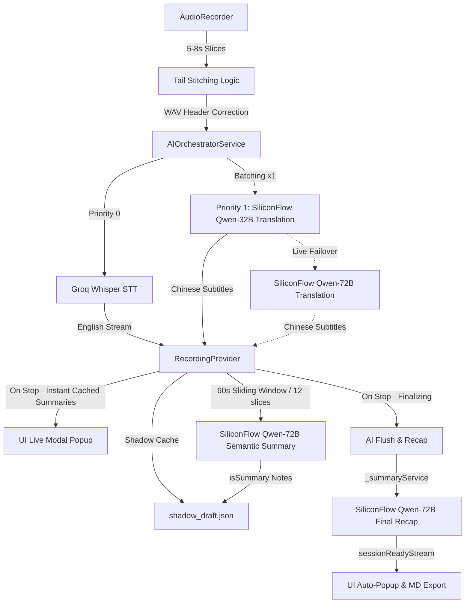

# Jeff Notes: Full Technical Specification & Architecture

## 1. System Overview
Jeff Notes is a production-grade academic assistant designed for high-concurrency audio transcription and professional academic translation. It operates on a **Session Isolation Architecture**, decoupling the active recording lifecycle from background AI finalization. The app is built with **Flutter 3.24.0+ (iOS 15.5+)**, using **Provider** for state management.

## 2. Core Data Flow (Zero-Latency Hybrid-Core Architecture)


## 3. Session Isolation & Concurrency
To allow users to start a new recording immediately after stopping the previous one, the system uses a non-blocking finalization pipeline:
- **RecordingProvider**: The central `ChangeNotifier` that manages the entire lifecycle — audio recording, AI orchestration, note storage, and export.
- **Decoupling**: When `stopRecording()` is called, the slice timer stops, the orchestrator flushes its buffer, and finalization begins asynchronously. The UI is immediately ready for the next recording.
- **Background Finalization**: `ApiScheduler.untilIdle()` waits for all pending AI tasks. The `_finalizeSession` flow handles: buffer flush, remaining batch summary, optional final recap, and Markdown export.
- **Shadow Cache Recovery**: On app start, `_checkRecoveryCache()` detects `shadow_draft.json`. Users can recover or dismiss pending notes.

## 4. AI Orchestration & Mode Handling
### 4.1 Mode-Specific Pipelines & Zero-Latency
The system adapts its prompt strategies and UI rendering based on the `AppMode` enum to deliver a zero-latency simultaneous translation experience:
- **Academic Lecture**: Focuses on `Thesis Statement` and `Logic Maps`. Exports structured 60s Block Summaries (`[P]` proposition, `[K]` key term, `[D]` data, `[L]` logic). UI uses **Blue** accents and `school` icons. **Latest Summary card is expanded by default.** On stop, instantly aggregates all cached summaries into a popup.
- **Group Discussion**: Focuses on strict `Concise Paraphrasing (Bilingual)` and `Discussion Starters`. Prompt extracts opinions (`[V]`), conflicts (`[C]`), consensus (`[A]`), and open questions (`[Q]`). UI uses **Purple** accents and `forum` icons. **Latest Summary card is collapsed by default (expandable on click).**
- **FreeTalk**: Focuses on raw, lightning-fast bilingual transcription and translation. No AI summary is generated. On stop, exports pure Chinese then pure English text without any headers or timestamps. UI uses default styling. **Latest Summary card is collapsed by default.**

### 4.2 AIOrchestratorService
Acts as the central bus between raw text and intelligence (`ai_orchestrator_service.dart`).
- **Fast Track (STT)**: Every audio slice is sent via `ApiScheduler` (priority 0) to Groq Whisper (`whisper-large-v3`). Raw text is sanitized by `TextSanitizer.clean()` (CJK removal, system marker stripping, word stutter dedup) and deduplicated via `mergeOverlappingText()`.
- **Zero-Latency Slow Track (Translation)**: By setting **`batchSize = 1`**, every 5-second slice is instantly translated via SiliconFlow Qwen-2.5-32B. Results are split by sentence boundaries and distributed back to corresponding notes.
- **Smart-Settling & Rolling Context**: The translation system prompt is optimized to detect unfinished sentences (input ending without punctuation) and translate them with a natural "hanging/unfinished" tone. The last 2 translation pairs are injected as `[Previous Context]` to maintain coherence.
- **Active Live Failover**: When the primary translation service fails, the orchestrator falls back to `translationFallbackService` (SiliconFlow Qwen-72B).
- **Terminology Interceptor**: Currently in pass-through mode (`terminology_interceptor.dart`). LLMs proved unreliable at preserving placeholders, so raw English is translated directly.

### 4.3 ApiScheduler (The Traffic Cop)
- **4 Parallel Slots**: Manages 4 concurrent network requests across all sessions.
- **Prioritization**: `Priority 0` (STT) always preempts `Priority 1` (Translation).
- **Retry Policy**: 429 (rate limit) backs off `10s × attempt`; 500/503 backs off `2s × attempt`. Max 3 attempts per task.
- **Session-Aware Idle**: Supports `untilSessionIdle(sessionId)` and global `untilIdle()` for export safety.

### 4.4 Summary Engine
- **60s Sliding Window**: Every 12 non-summary notes trigger `_performBatchSummary()` via SiliconFlow Qwen-72B. Results are stored as `InsightNote(isSummary: true)`.
- **Final Recap (Optional)**: If `enableFinalRecap` is on, `generateFinalAcademicReview()` aggregates all summary notes and calls `_aiService.summarize(strategy: recap)`. Primary service failure triggers fallback. Markdown export is guaranteed via `try/finally`.

## 5. UI Structure

### 5.1 Screen Hierarchy
```
AcademicHubScreen (Home)
  ├── NotesScreen (Audio Transcription & Translation)
  ├── EssayConfigScreen (对比文章模板写作)
  ├── ReadingScreen (阅读精读列表)
  │     ├── ReadingSessionScreen (截图/PDF → OCR导入)
  │     └── ReadingDetailScreen (原文+摘要/翻译/转述/生词/AI出题)
  └── HistoryScreen (Past Sessions)
        └── NoteDetailScreen (MD Viewer + PDF Export)
```

### 5.2 NotesScreen Layout (`notes_screen.dart`)
- **Summary Notification Banner**: Appears when `sessionReadyStream` emits new content. Auto-prompts modal.
- **Cache Recovery Bar**: Detects unfinished sessions from `shadow_draft.json`.
- **Summary Panel**: Selector-bound to `notes.where(isSummary)`. Shows latest summary via `MarkdownBody`. Lecture mode expands by default; Discussion mode collapses.
- **Transcript List**: Each item shows English text + Chinese translation. `RepaintBoundary` + `ValueKey(note.id)` for efficient rendering. `ClampingScrollPhysics` prevents scroll bounce during async translation updates.
- **FAB (RecordingPulseFAB)**: Red pulse animation during recording, orange static glow when paused, mic icon when idle.

### 5.3 EssayConfigScreen (对比文章模板写作)
- Accepts Topic A, Topic B, difficulty level, and AI model selection (Llama-3.3-70B / Qwen-32B / Qwen-72B).
- Generates two complete essays (pure similarities, pure differences) using steel-template prompts with EAL-friendly chunk extraction.
- Auto-retries once on failure (5s delay). Auto-saves to MD, supports clipboard copy and PDF export.

## 6. Event-Driven UI & Auto-Popup
The UI does not poll for summary completion. Instead, it uses a **Reactive Notification Stream**:
- **sessionReadyStream**: A broadcast stream in `RecordingProvider`.
- **Trigger**: Emits the final recap content when `_finalizeSession` is complete, or aggregates live 60s Block summaries immediately upon stopping in Lecture Mode.
- **Consumption**: `NotesScreen` listens to this stream and automatically triggers the `FinalReviewModal` strictly during Lecture Mode. Real-time translation streams are completely separated from this stream to guarantee no premature, empty, or annoying banner popups during live recording sessions.

## 7. Audio Ingestion & Stitching Protocol
- **Smart Slice Timer**: A `Timer.periodic` fires every 5-8 seconds (user-configurable). Stops current recording and starts a new one (stop-start cycle).
- **Overlap-Stitch Algorithm**: Captures a trailing 25,600 byte PCM segment (`kTailSize`) to prevent word-chopping at slice boundaries. Stitching runs in a background Isolate via `compute()`.
- **WAV Integrity**: Manually generates a 44-byte WAV header for each slice (16kHz, 16-bit, Mono) in the background Isolate.
- **Pause/Resume**: Stops the slice timer and recorder without clearing notes. On resume, restarts recording and timer, seamlessly appending new slices.

## 8. Domain-Specific Translation (EAL Optimized)
- **Philosophy**: Uses a **Simultaneous Interpreter Prompt** with strict temperature (`0.1`) to ensure academic tone and technical term preservation.
- **Sanitization Pipeline (`text_sanitizer.dart`)**: CJK character removal, system marker stripping, invisible character removal, word stutter dedup (`_removeWordStutter`), and overlapping text merge for slice boundary dedup.

## 9. Data Persistence Hierarchy
1. **Shadow Cache (Ephemeral)**: `shadow_draft.json` written to temporary directory on every translation result, enabling crash recovery.
2. **MD Export (Permanent)**: Written to `getApplicationDocumentsDirectory()`. Filename format: `Jeff_Notes_yyyyMMdd_HHmm.md`. Structure: Part 1 (AI Academic Review), Part 2 (60s Block Summaries), Part 3 (Chinese Transcript + English Transcript split cleanly).
   - FreeTalk export: `Jeff_FreeTalk_yyyyMMdd_HHmmss.md` (pure Chinese then English, no headers).
   - Essay export: `Jeff_Essay_topicA_yyyyMMdd_HHmm.md`.
3. **PDF Export**: Via `PdfService` using `flutter_markdown` + `pdf`/`printing` packages.

## 10. Development Environment (Hybrid Distributed Engine)
- **STT (Fast Track)**: Groq API (`whisper-large-v3`).
- **Translation (Real-Time)**: SiliconFlow (`Qwen/Qwen2.5-32B-Instruct`) as primary, SiliconFlow (`Qwen/Qwen2.5-72B-Instruct`) as secondary fallback.
- **60s Sliding Summary (Background)**: SiliconFlow (`Qwen/Qwen2.5-72B-Instruct`).
- **Final Summary (Intelligence)**: Primary `_aiService` (Qwen-32B) with fallback to `_summaryService` (Qwen-72B).
- **Essay Generation**: Groq (`llama-3.3-70b-versatile`, ~10s) or SiliconFlow Qwen-32B (~30s) or SiliconFlow Qwen-72B (~60s).
- **Framework**: Flutter 3.24.0+ (iOS 15.5+).

## 11. Supabase Cloud Sync (FileSyncAgent)

### 11.1 Purpose
Automatic cloud backup of all `.md` export files. New recordings/writing exports are synchronised to Supabase `archives` table without modifying existing RecordingProvider or export logic.

### 11.2 supabase_config.dart
Encapsulates Supabase initialisation with a singleton pattern:
- `SupabaseConfig.url` – Supabase project URL (static const).
- `SupabaseConfig.anonKey` – Anon key for client-side access (static const).
- `SupabaseConfig.init()` – Calls `Supabase.initialize()` before `runApp()`.
- `SupabaseConfig.client` – Shortcut to `Supabase.instance.client`.

### 11.3 file_sync_agent.dart
- Launched in `main()` after Supabase initialisation.
- Recurring 30-second scan of `getApplicationDocumentsDirectory()` for `.md` files.
- Skips files already uploaded via `UploadCache` (SharedPreferences hash check).
- Uploads new files as `archives` rows with `module='recording'` / `module='essay'`.
- Completely independent from RecordingProvider; no Provider dependency.

### 11.4 upload_cache.dart
- Thin wrapper over `SharedPreferences`.
- Stores MD5 hashes of uploaded file content to prevent duplicate sync.
- `isUploaded(hash)` / `markUploaded(hash)` / `clear()`.

### 11.5 Database Schema
```sql
CREATE TABLE archives (
  id        UUID DEFAULT gen_random_uuid() PRIMARY KEY,
  module    TEXT NOT NULL,
  file_hash TEXT NOT NULL UNIQUE,
  title     TEXT NOT NULL DEFAULT '',
  content_md TEXT NOT NULL DEFAULT '',
  metadata  JSONB DEFAULT '{}',
  file_size INTEGER DEFAULT 0,
  created_at TIMESTAMPTZ DEFAULT NOW()
);
```
Row-Level Security is **disabled** on `archives` for personal-project simplicity.

## 12. Reading Module (精读)

### 12.1 Architecture Overview
A completely independent module that reuses the `archives` table with `module='reading'` for storage. All code is isolated in `lib/screens/reading_*.dart` and `lib/services/reading_quiz_service.dart` – zero changes to recording/essay/history modules.

### 12.2 Screens

#### ReadingScreen (阅读列表)
- Loads entries from Supabase: `.from('archives').select().eq('module', 'reading').order('created_at', ascending: false)`.
- `RefreshIndicator` and AppBar refresh button for manual reload.
- `Dismissible` cards with swipe-to-delete.
- FAB navigates to `ReadingSessionScreen`.

#### ReadingSessionScreen (导入界面)
- **Screenshots**: Uses `ImagePicker.pickMultiImage()` for multi-select, `ReorderableListView` for drag-to-reorder, then OCR batch.
- **PDF Import**: Uses `FilePicker` + `pdf_render` to render each page to PNG → `OcrService.recognizeText()` (max 30 pages with progress).
- After OCR, joins page texts with `\n\n---\n\n`, saves to Supabase with `.insert({'module':'reading', ...})`.
- Success/failure feedback via SnackBar; pops back to list on completion.

#### ReadingDetailScreen (精读详情)
- Renders original text with toggle between Markdown-rendered and raw monospace view (AppBar toggle button `</>` ↔ `📄`).
- Title is tappable for inline rename (persisted to Supabase).
- Action buttons row 1: `[AI 出题] [📝 摘要] [📖 生词]`
- Action buttons row 2: `[🌐 翻译] [💬 转述] [导出]`
- Translation and paraphrasing open a bottom sheet with editable text (user can trim to specific passage before sending).
- Each AI result appears independently below the buttons, closable with ✕.

### 12.3 Services

#### ReadingQuizService (reading_quiz_service.dart)
Common Groq API caller with 5 static methods, all following the same pattern (read API key → call `llama-3.3-70b-versatile` → return markdown string):
- `generateQuiz(text)` → 3 questions (main idea, detail, vocabulary)
- `getSummary(text)` → structured Chinese summary with key arguments and English terms
- `getTranslation(text)` → paragraph-by-paragraph bilingual translation
- `getParaphrase(text)` → simplified English + Chinese restatement
- `getVocabulary(text)` → ~20 academic words with definitions, examples, and Chinese glosses

Private helper `_callGroq(systemPrompt, text)` reduces duplication.

#### OcrService (ocr_service.dart)
- Wraps Google ML Kit `TextRecognizer` (Chinese + Latin scripts).
- `recognizeText(XFile)` → returns recognised plain text string.
- Runs 100% offline; no network dependency.

### 12.4 Prompt Additions (prompt_provider.dart)
5 new prompts added alongside existing lecture/discussion prompts:
- `getReadingQuizPrompt()` / `getReadingSummaryPrompt()` / `getReadingTranslationPrompt()` / `getReadingParaphrasePrompt()` / `getReadingVocabularyPrompt()`

### 12.5 AI Configuration
All reading AI features use:
- **Model**: Groq `llama-3.3-70b-versatile`
- **API Key**: Read from `SharedPreferences` key `api_key_groq` (shared with existing STT service)
- **Temperature**: 0.5
- **Timeout**: 60 seconds

## 13. Dependencies Added (pubspec.yaml)

| Package | Version | Purpose |
|---|---|---|
| `supabase_flutter` | ^2.7.1 | Supabase client for cloud storage |
| `crypto` | ^3.0.6 | MD5/SHA256 hashing for upload cache and file_hash |
| `google_mlkit_text_recognition` | ^0.14.0 | Offline OCR (Chinese + Latin) |
| `image_picker` | ^1.1.2 | Multi-select photo import |
| `file_picker` | ^8.1.7 | PDF file selection |
| `pdf_render` | ^1.5.1 | PDF page-to-image rendering for OCR |
| `flutter_tts` | ^4.1.0 | Offline native text-to-speech for Chinese summary |
| `just_audio` | ^0.9.39 | Audio player for English realistic TTS and local recordings |
| `audio_service` | ^0.18.15 | System audio session and background playback integration |

## 14. Grammar Module (语法精讲)

### 14.1 Architecture Overview
A specialized grammar learning and correction system. It displays structural textbook data based on the Focus on Grammar 4 series, and integrates with LLM endpoints for practice and interactive questioning. All UI code is located in [grammar_screen.dart](file:///Users/macmini/jeff_notes/lib/screens/grammar_screen.dart) and [grammar_detail_screen.dart](file:///Users/macmini/jeff_notes/lib/screens/grammar_detail_screen.dart).

### 14.2 Repository Pattern (grammar_repository.dart)
Implements a **three-tier data source hierarchy** for retrieving academic grammar structures:
1. **Cloud (Supabase)**: Fetches curriculum details from the `grammar_units` table ordered by `sort_order` via HTTP GET.
2. **Local Cache File**: Serializes retrieved data to `grammar_units_cache.json` in the App Support Directory. Subsequent loads read from cache if offline.
3. **Hardcoded Backup**: Falls back to offline asset data defined in `grammar_content.dart` if both cloud and cache access fail.

### 14.3 Service & Prompts (grammar_service.dart)
Uses Groq API (`llama-3.3-70b-versatile` model) with specialized prompts configured in `PromptProvider`:
- **generateExercise(unit)**: Generates 5 target grammar practice questions based on unit objectives.
- **askQuestion(unit, question)**: Provides contextual explanations for custom user queries about specific rules.
- **correctSentence(sentence)**: Performs sentence correction, highlighting structural improvements.

---

## 15. TTS Player & Service Module (语音朗读与播放安全)

### 15.1 Core Architecture
The system encapsulates audio playback through `TtsService` (a ChangeNotifier singleton) and provides interactive playback UI via `TtsPlayerBar` (in `tts_player_bar.dart`). It separates Chinese and English playback pipelines to optimize latency and user experience:
1. **Chinese Playback Pipeline (0ms Latency)**: Sanitizes markdown syntax and uses `flutter_tts` to invoke the device's native offline TTS engine. Starts instantly with zero cloud API latency.
2. **English Playback Pipeline (High-Fidelity AI)**: Synthesizes realistic speech via SiliconFlow API, saves the output stream using `just_audio`, and supports real-time progress updates, duration tracking, and slider scrubbing.
3. **Recorded Playback**: If a merged recording (.wav) exists for the session, `TtsPlayerBar` supports direct playback of the user's local recorded voice.

### 15.2 Headphone Safety & Automatic Interruption
To prevent accidental sound leakage in quiet environments (e.g., libraries, classrooms), the system enforces strict audio output safety rules:
- **Headphone Check**: Playback will not start unless headphones or Bluetooth headsets are actively connected. It queries the platform's current audio route outputs (`AVAudioSession` outputs on iOS) to ensure a physical speaker is not being used.
- **Disconnection Listener**: Subscribes to `AudioSession.devicesChangedEventStream`. If headphones (wired/wireless/AirPods) are disconnected, the playback session is instantly paused.
- **Microphone Co-existence**: Configures the `AudioSession` category to `AVAudioSessionCategory.playAndRecord` with speaker defaulting. This ensures that the active microphone recording capability is not locked or interrupted when TTS audio plays.

