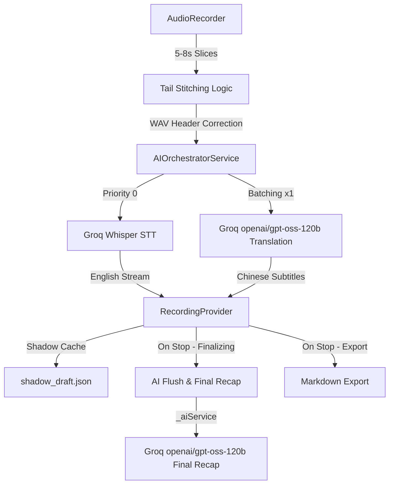

# Jeff Notes: Full Technical Specification & Architecture

## 1. System Overview
Jeff Notes is a production-grade academic assistant designed for high-concurrency audio transcription and professional academic translation. It operates on a **Session Isolation Architecture**, decoupling the active recording lifecycle from background AI finalization. The app is built with **Flutter 3.24.0+ (iOS 15.5+)**, using **Provider** for state management.

## 2. Core Data Flow (Zero-Latency Hybrid-Core Architecture)


## 3. Session Isolation & Concurrency
> ⚠️ **2026-07-31 已升级为 Session Isolation v2**：请以「15.1 ~ 15.4」为准。以下为历史描述，保留仅供追溯。

To allow users to start a new recording immediately after stopping the previous one, the system uses a non-blocking finalization pipeline:
- **RecordingProvider**: The central `ChangeNotifier` that manages the entire lifecycle — audio recording, AI orchestration, note storage, and export.
- **Decoupling**: When `stopRecording()` is called, the slice timer stops, the orchestrator flushes its buffer, and finalization begins asynchronously. The UI is immediately ready for the next recording.
- **Background Finalization**: `ApiScheduler.untilIdle()` waits for all pending AI tasks. The `generateFinalAcademicReview` flow handles: buffer flush, optional final recap, and Markdown export.
- **Shadow Cache Recovery**: On app start, `_checkRecoveryCache()` detects `shadow_draft.json`. Users can recover or dismiss pending notes.

## 3. AI Orchestration & Mode Handling
### 3.1 Mode-Specific Pipelines & Zero-Latency
The system adapts its prompt strategies and UI rendering based on the `AppMode` enum to deliver a zero-latency simultaneous translation experience:
- **Academic Lecture**: Focuses on `Thesis Statement` and `Logic Maps`. Exports structured 60s Block Summaries (`[P]` proposition, `[K]` key term, `[D]` data, `[L]` logic). UI uses **Blue** accents and `school` icons. **Latest Summary card is expanded by default.** On stop, instantly aggregates all cached summaries into a popup.
- **Group Discussion**: Focuses on strict `Concise Paraphrasing (Bilingual)` and `Discussion Starters`. Prompt extracts opinions (`[V]`), conflicts (`[C]`), consensus (`[A]`), and open questions (`[Q]`). UI uses **Purple** accents and `forum` icons. **Latest Summary card is collapsed by default (expandable on click).**
- **FreeTalk**: Focuses on raw, lightning-fast bilingual transcription and translation. No AI summary is generated. On stop, exports pure Chinese then pure English text without any headers or timestamps. UI uses default styling. **Latest Summary card is collapsed by default.**

### 3.2 AIOrchestratorService
Acts as the central bus between raw text and intelligence (`ai_orchestrator_service.dart`).
- **Fast Track (STT)**: Every audio slice is sent via `ApiScheduler` (priority 0) to Groq Whisper (`whisper-large-v3`). Raw text is sanitized by `TextSanitizer.clean()` (CJK removal, system marker stripping, word stutter dedup) and deduplicated via `mergeOverlappingText()`.
- **Zero-Latency Slow Track (Translation)**: By setting **`batchSize = 1`**, every 5-second slice is instantly translated via Groq `openai/gpt-oss-120b`. Results are split by sentence boundaries and distributed back to corresponding notes.
- **Smart-Settling & Rolling Context**: The translation system prompt is optimized to detect unfinished sentences (input ending without punctuation) and translate them with a natural "hanging/unfinished" tone. The last 2 translation pairs are injected as `[Previous Context]` to maintain coherence.
- **Active Live Failover**: When the primary translation service fails, the orchestrator falls back to `translationFallbackService`. In the current implementation, both primary and fallback are bound to the same Groq service instance.
- **Terminology Interceptor**: Currently in pass-through mode (`terminology_interceptor.dart`). LLMs proved unreliable at preserving placeholders, so raw English is translated directly.

### 2.1 Actual AI Service Binding (recording_provider.dart `_updateService()`)
All AI services are bound to **Groq** (`openai/gpt-oss-120b` for chat, `whisper-large-v3` for STT):

| Role | Service | Model |
|------|---------|-------|
| STT (Fast Track) | Groq | `whisper-large-v3` |
| Translation (Slow Track) | Groq | `openai/gpt-oss-120b` |
| Translation Fallback | Groq | `openai/gpt-oss-120b` (same instance) |
| Final Recap | Groq | `openai/gpt-oss-120b` |
| Essay Generation | Gemini | `gemini-2.5-flash` |
| Reading AI (Quiz/Summary/Translation/Paraphrase/Vocab) | Groq | `openai/gpt-oss-120b` |
| Grammar AI (Exercise/Question/Correction) | Groq | `openai/gpt-oss-120b` |

**SiliconFlow (硅基流动) 实际使用情况**:
- **TTS 英文语音合成** (`tts_service.dart:943-978`): 使用 `FunAudioLLM/CosyVoice2-0.5B` Bella 女声做英文 AI 拟真音色合成。这是硅基流动在 App 中**唯一实际被使用**的功能。
- **STT 备选支持** (`openai_service.dart:63-70`): 代码层面支持硅基流动的 SenseVoiceSmall 模型做 STT（当 baseUrl 包含 siliconflow 时），但实际配置中 STT 走 Groq。
- **FreeTalk 翻译** (`recording_provider.dart:587-607`): 代码中有 `_translateViaSiliconFlow()` 方法，但实际调用的是 `_aiService!.translate()`，而 `_aiService` 被绑定为 Groq 服务，所以 FreeTalk 翻译实际走 Groq。

### 2.1 实际 AI 服务绑定一览

| 功能 | 实际服务 | 实际模型 |
|------|---------|---------|
| STT 语音转写 (首选) | Groq | `whisper-large-v3` |
| STT 语音转写 (降级) | Google Gemini | `gemini-2.5-flash` (多模态音频直接转写) |
| 实时翻译 | Groq | `openai/gpt-oss-120b` |
| 翻译兜底 | Groq | `openai/gpt-oss-120b` (同一实例) |
| 最终复盘 (Final Recap) | Groq | `openai/gpt-oss-120b` |
| 作文生成 | Gemini | `gemini-2.5-flash` |
| 精读 AI (出题/摘要/翻译/转述/生词) | Groq | `openai/gpt-oss-120b` |
| 语法 AI (出题/问答/纠错) | Groq | `openai/gpt-oss-120b` |
| 英文 TTS 语音合成 | SiliconFlow (首选) | `FunAudioLLM/CosyVoice2-0.5B` Bella |
| 英文 TTS 降级方案 1 | Google Gemini | `Gemini 2.0 Flash` / `en-US-Studio-O` |
| 英文 TTS 降级方案 2 | Microsoft Edge | `en-US-JennyNeural` |
| 中文 TTS | iOS 原生 / 微软 Edge | `zh-CN-XiaoxiaoNeural` |

### 2.1 硅基流动 (SiliconFlow) 实际使用情况

硅基流动在 App 中**唯一实际被使用**的功能是 **TTS 英文语音合成** (`tts_service.dart:943-978`):
- 使用 `FunAudioLLM/CosyVoice2-0.5B` 模型，Bella 女声
- 作为英文 TTS 的首选方案，失败后降级到 Gemini → Edge Neural → iOS 原生

代码中存在的硅基流动备选支持（但实际未启用）：
- **STT 备选** (`openai_service.dart:63-70`): 当 baseUrl 包含 "siliconflow" 时，使用 SenseVoiceSmall 模型做 STT。但实际配置中 STT 走 Groq。
- **FreeTalk 翻译** (`recording_provider.dart:587-607`): `_translateViaSiliconFlow()` 方法存在，但实际调用的是 `_aiService!.translate()`，而 `_aiService` 被绑定为 Groq 服务。

## 3. Session Isolation & Concurrency
To allow users to start a new recording immediately after stopping the previous one, the system uses a non-blocking finalization pipeline:
- **RecordingProvider**: The central `ChangeNotifier` that manages the entire lifecycle — audio recording, AI orchestration, note storage, and export.
- **Decoupling**: When `stopRecording()` is called, the slice timer stops, the orchestrator flushes its buffer, and finalization begins asynchronously. The UI is immediately ready for the next recording.
- **Background Finalization**: `ApiScheduler.untilIdle()` waits for all pending AI tasks. The `generateFinalAcademicReview` flow handles: buffer flush, optional final recap, and Markdown export.
- **Shadow Cache Recovery**: On app start, `_checkRecoveryCache()` detects `shadow_draft.json`. Users can recover or dismiss pending notes.

## 4. AI Orchestration & Mode Handling
### 4.1 Mode-Specific Pipelines & Zero-Latency
The system adapts its prompt strategies and UI rendering based on the `AppMode` enum to deliver a zero-latency simultaneous translation experience:
- **Academic Lecture**: Focuses on `Thesis Statement` and `Logic Maps`. Exports structured Markdown with Full Script + AI Review + Block Summaries. UI uses **Blue** accents and `school` icons. **Latest Summary card is expanded by default.** On stop, triggers `FinalReviewModal` popup.
- **Group Discussion**: Focuses on strict `Concise Paraphrasing (Bilingual)` and `Discussion Starters`. Prompt extracts opinions (`[V]`), conflicts (`[C]`), consensus (`[A]`), and open questions (`[Q]`). UI uses **Purple** accents and `forum` icons. **Latest Summary card is collapsed by default (expandable on click).**
- **FreeTalk**: Focuses on raw, lightning-fast bilingual transcription and translation. No AI summary is generated. On stop, exports pure Chinese then pure English text without any headers or timestamps. UI uses default styling. **Latest Summary card is collapsed by default.**

### 4.2 AIOrchestratorService
Acts as the central bus between raw text and intelligence (`ai_orchestrator_service.dart`).
- **Fast Track (STT)**: Every audio slice is sent via `ApiScheduler` (priority 0) to Groq Whisper (`whisper-large-v3`). Raw text is sanitized by `TextSanitizer.clean()` (CJK removal, system marker stripping, word stutter dedup) and deduplicated via `mergeOverlappingText()`.
- **Zero-Latency Slow Track (Translation)**: By setting **`batchSize = 1`**, every 5-second slice is instantly translated via Groq `openai/gpt-oss-120b`. Results are split by sentence boundaries and distributed back to corresponding notes.
- **Smart-Settling & Rolling Context**: The translation system prompt is optimized to detect unfinished sentences (input ending without punctuation) and translate them with a natural "hanging/unfinished" tone. The last 2 translation pairs are injected as `[Previous Context]` to maintain coherence.
- **Active Live Failover**: When the primary translation service fails, the orchestrator falls back to `translationFallbackService`. In the current implementation, both primary and fallback are bound to the same Groq service instance.
- **Terminology Interceptor**: Currently in pass-through mode (`terminology_interceptor.dart`). LLMs proved unreliable at preserving placeholders, so raw English is translated directly.

### 4.3 ApiScheduler (The Traffic Cop)
- **4 Parallel Slots**: Manages 4 concurrent network requests across all sessions.
- **Prioritization**: `Priority 0` (STT) always preempts `Priority 1` (Translation).
- **Retry Policy**: 429 (rate limit) backs off `10s × attempt`; 500/503 backs off `2s × attempt`. Max 3 attempts per task.
- **Session-Aware Idle**: Supports `untilSessionIdle(sessionId)` and global `untilIdle()` for export safety.

### 4.3 Summary Engine
- **60s Sliding Window**: The `InsightNote` model has an `isSummary` field and the export code references "60s Block Summaries", but the actual `_performBatchSummary()` method that would generate these summaries **does not exist in the codebase**. No notes with `isSummary: true` are ever created during recording.
- **Final Recap (Optional)**: If `enableFinalRecap` is on, `generateFinalAcademicReview()` aggregates all transcript text and calls `_aiService.summarize(strategy: recap)`. Primary service failure triggers fallback. Markdown export is guaranteed via `try/finally`.

## 5. UI Structure

### 5.1 Screen Hierarchy
```
AcademicHubScreen (Home)
  ├── NotesScreen (Audio Transcription & Translation)
  ├── EssayConfigScreen (对比文章模板写作)
  ├── ReadingScreen (阅读精读列表)
  │     ├── ReadingSessionScreen (截图/PDF → OCR导入)
  │     └── ReadingDetailScreen (原文+摘要/翻译/转述/生词/AI出题)
  ├── GrammarScreen (语法精讲列表)
  │     └── GrammarDetailScreen (语法详情)
  └── HistoryScreen (Past Sessions)
        └── NoteDetailScreen (MD Viewer + PDF Export)
```

### 5.2 NotesScreen Layout (`notes_screen.dart`)
- **Summary Notification Banner**: Appears when `sessionReadyStream` emits new content. Auto-prompts modal in Lecture mode.
- **Cache Recovery Bar**: Detects unfinished sessions from `shadow_draft.json`.
- **Summary Panel**: Selector-bound to `notes.where(isSummary)`. Shows latest summary via `MarkdownBody`. Lecture mode expands by default; Discussion mode collapses.
- **Transcript List**: Each item shows English text + Chinese translation. `RepaintBoundary` + `ValueKey(note.id)` for efficient rendering. `ClampingScrollPhysics` prevents scroll bounce during async translation updates.
- **FAB (RecordingPulseFAB)**: Red pulse animation during recording, orange static glow when paused, mic icon when idle.

### 5.2 EssayConfigScreen (学术写作助手)
- **Dual-Input Topic Mechanism**: A custom `TextField` (hint: "例如: wearing masks") sits above a category-based topic grid. If the custom field is non-empty, it overrides the preset selection entirely.
- **46 Preset Topics in 11 Categories**: Transportation & Safety, Technology & Digital, Daily Life & Consumer, School & Study, Work & Career, Media & Entertainment, Health & Lifestyle, Environment & Sustainability, Society & Culture, Family & Relationships, Ethics & Technology Boundaries.
- **Topic Picker**: `ChoiceChip` grid (`Wrap` layout) displays chinese-only labels for one-glance scanning; category switch reloads the grid instantly.
- **Essay Type Toggle**: Comparison (Intro → Cost → Happiness → Time → Conclusion) or Argumentative (Intro → Cost → Happiness → Time-based Refutation → Conclusion).
- **Cost · Time · Happiness Framework**: Essays are structured around these three concrete angles, replacing vague "advantages/disadvantages" with measurable dimensions. The flexible skeleton allows 4-5 sentences per paragraph with free ordering of Cost/Happiness/Time across body paragraphs — no rigid template enforcement.
- **AI Prompt** (in `RecordingProvider.generateEssayMatrix`): Chinese system prompt with simple-vocabulary 大白话 style (避免复杂从句, 用最简单直白的语言说明道理, 像在跟一个初中生说话). Essays follow a skeleton (Topic Sentence → Why → Example → How it relates → Extra) but ordering of the three angles is free.
- **Model**: Gemini `gemini-2.5-flash` via direct HTTP REST API (replaces former Groq `openai/gpt-oss-120b`). Requires Gemini API Key from Settings page. Auto-retry once on failure (5s delay).
- **Export**: Auto-saves to Markdown (`Jeff_Essay_{topic}_{timestamp}.md`), clipboard copy, and PDF export via `PdfService`.

## 6. Event-Driven UI & Auto-Popup
> ⚠️ **2026-07-31 已升级**：`sessionReadyStream` 现在发射的是 `SessionReadyEvent`（结构化事件，见 15.2/15.3），不再是裸 `String`。以下为历史描述。

The UI does not poll for summary completion. Instead, it uses a **Reactive Notification Stream**:
- **sessionReadyStream**: A broadcast stream in `RecordingProvider`.
- **Trigger**: Emits the final recap content when `generateFinalAcademicReview` is complete.
- **Consumption**: `NotesScreen` listens to this stream and automatically triggers the `FinalReviewModal` strictly during Lecture Mode. Real-time translation streams are completely separated from this stream to guarantee no premature, empty, or annoying banner popups during live recording sessions.

## 7. Audio Ingestion & Stitching Protocol
- **Smart Slice Timer**: A `Timer.periodic` fires every 5-8 seconds (user-configurable). Stops current recording and starts a new one (stop-start cycle).
- **Overlap-Stitch Algorithm**: Captures a trailing 25,600 byte PCM segment (`kTailSize`) to prevent word-chopping at slice boundaries. Stitching runs in a background Isolate via `compute()`.
- **WAV Integrity**: Manually generates a 44-byte WAV header for each slice (16kHz, 16-bit, Mono) in the background Isolate.
- **Pause/Resume**: Stops the slice timer and recorder without clearing notes. On resume, restarts recording and timer, seamlessly appending new slices.

## 8. Domain-Specific Translation (EAL Optimized)
- **Philosophy**: Uses a **Simultaneous Interpreter Prompt** with strict temperature (`0.1`) to ensure academic tone and technical term preservation.
- **Sanitization Pipeline (`text_sanitizer.dart`)**: CJK character removal, system marker stripping, invisible character removal, word stutter dedup (`_removeWordStutter`), and overlapping text merge for slice boundary dedup.

## 9. Data Persistence Hierarchy
1. **Shadow Cache (Ephemeral)**: `shadow_draft.json` written to temporary directory on every translation result, enabling crash recovery.
2. **MD Export (Permanent)**: Written to `getApplicationDocumentsDirectory()`. Filename format: `Jeff_Notes_yyyyMMdd_HHmm.md`. Structure: Part 1 (Full Script: Chinese + English), Part 2 (AI Academic Review), Part 3 (60s Block Summaries — currently unused as no summary notes are generated).
   - FreeTalk export: `Jeff_FreeTalk_yyyyMMdd_HHmmss.md` (pure Chinese then English, no headers).
   - Essay export: `Jeff_Essay_topicA_yyyyMMdd_HHmm.md`.
3. **PDF Export**: Via `PdfService` using `flutter_markdown` + `pdf`/`printing` packages.

## 8. Development Environment (Actual AI Service Binding)

| 功能 | 实际服务 | 实际模型 | 文件位置 |
|------|---------|---------|---------|
| STT 语音转写 | Groq | `whisper-large-v3` | `openai_service.dart:48` |
| 实时翻译 | Groq | `openai/gpt-oss-120b` | `recording_provider.dart:378-381` |
| 翻译兜底 | Groq | `openai/gpt-oss-120b` (同一实例) | `recording_provider.dart:381` |
| 最终复盘 (Final Recap) | Groq | `openai/gpt-oss-120b` | `recording_provider.dart:727` |
| 作文生成 | Gemini | `gemini-2.5-flash` | `recording_provider.dart:995-1063` |
| 精读 AI (出题/摘要/翻译/转述/生词) | Groq | `openai/gpt-oss-120b` | `reading_quiz_service.dart:24` |
| 语法 AI (出题/问答/纠错) | Groq | `openai/gpt-oss-120b` | `grammar_service.dart:9` |
| 英文 TTS 语音合成 (首选) | **SiliconFlow** | `FunAudioLLM/CosyVoice2-0.5B` Bella | `tts_service.dart:943-978` |
| 英文 TTS 语音合成 (降级1) | Google Gemini | `Gemini 2.0 Flash` / `en-US-Studio-O` | `tts_service.dart:827-941` |
| 英文 TTS 语音合成 (降级2) | Microsoft Edge | `en-US-JennyNeural` | `tts_service.dart:781-824` |
| 英文 TTS 语音合成 (离线兜底) | iOS 原生 | Samantha/Ava/Karen | `tts_service.dart:640-674` |
| 中文 TTS (首选) | 微软 Edge | `zh-CN-XiaoxiaoNeural` | `tts_service.dart:510-555` |
| 中文 TTS (备选) | iOS 原生 | 系统中文语音 | `tts_service.dart:371-428` |

### 硅基流动 (SiliconFlow) 实际使用情况

硅基流动在 App 中**唯一实际被使用**的功能是 **TTS 英文语音合成** (`tts_service.dart:943-978`):
- 模型: `FunAudioLLM/CosyVoice2-0.5B`
- 音色: `bella` (高清流畅自然英文播音女声)
- 端点: `https://api.siliconflow.cn/v1/audio/speech`
- 作为英文 TTS 的首选方案，失败后降级到 Gemini → Edge Neural → iOS 原生

代码中存在的硅基流动备选支持（但实际未启用）:
- **STT 备选** (`openai_service.dart:63-70`): 当 baseUrl 包含 "siliconflow" 时，使用 SenseVoiceSmall 模型做 STT。但实际配置中 STT 走 Groq。
- **FreeTalk 翻译** (`recording_provider.dart:587-607`): `_translateViaSiliconFlow()` 方法存在，但实际调用的是 `_aiService!.translate()`，而 `_aiService` 被绑定为 Groq 服务。

## 9. Data Persistence Hierarchy
> ⚠️ **2026-07-31 已升级**：Shadow 草稿由 `ShadowDraftService` 管理，文件名为 `shadow_draft_<sessionId>.json`（紧邻 `.md` 导出文件），原子写入、schema v1 校验，详见 15.4。以下为历史描述。

1. **Shadow Cache (Ephemeral)**: `shadow_draft.json` written to temporary directory on every translation result, enabling crash recovery.
2. **MD Export (Permanent)**: Written to `getApplicationDocumentsDirectory()`. Filename format: `Jeff_Notes_yyyyMMdd_HHmm.md`. Structure: Part 1 (Full Script: Chinese + English), Part 2 (AI Academic Review), Part 3 (60s Block Summaries — currently unused as no summary notes are generated).
   - FreeTalk export: `Jeff_FreeTalk_yyyyMMdd_HHmmss.md` (pure Chinese then English, no headers).
   - Essay export: `Jeff_Essay_topicA_yyyyMMdd_HHmm.md`.
3. **PDF Export**: Via `PdfService` using `flutter_markdown` + `pdf`/`printing` packages.

## 9. Supabase Cloud Sync (FileSyncAgent)

### 9.1 Purpose
Automatic cloud backup of all `.md` export files. New recordings/writing exports are synchronised to Supabase `archives` table without modifying existing RecordingProvider or export logic.

### 9.2 supabase_config.dart
Encapsulates Supabase initialisation with a singleton pattern:
- `SupabaseConfig.url` – Supabase project URL (static const).
- `SupabaseConfig.anonKey` – Anon key for client-side access (static const).
- `SupabaseConfig.init()` – Calls `Supabase.initialize()` before `runApp()`.
- `SupabaseConfig.client` – Shortcut to `Supabase.instance.client`.

### 9.3 file_sync_agent.dart
- Launched in `main()` after Supabase initialisation.
- Recurring 30-second scan of `getApplicationDocumentsDirectory()` for `.md` files.
- Skips files already uploaded via `UploadCache` (SharedPreferences hash check).
- Uploads new files as `archives` rows with `module` inferred from filename: `essay`, `discussion`, `freetalk`, `reading`, or `listening`.
- **2026-07-31**: 未登录时（`currentUserIdOrNull == null`）直接跳过同步并记录日志；上传改用 `.upsert(onConflict: 'user_id,session_id')` 并携带 `session_id: 'file_$hash'`，实现幂等写入、不再产生重复行（配合迁移 `20260731_session_id_upsert.sql`）。
- Completely independent from RecordingProvider; no Provider dependency.

### 9.4 upload_cache.dart
- Thin wrapper over `SharedPreferences`.
- Stores MD5 hashes of uploaded file content to prevent duplicate sync.
- `isUploaded(hash)` / `markUploaded(hash)` / `clear()`.

### 9.5 Database Schema
```sql
CREATE TABLE archives (
  id        UUID DEFAULT gen_random_uuid() PRIMARY KEY,
  module    TEXT NOT NULL,
  file_hash TEXT NOT NULL UNIQUE,
  title     TEXT NOT NULL DEFAULT '',
  content_md TEXT NOT NULL DEFAULT '',
  metadata  JSONB DEFAULT '{}',
  file_size INTEGER DEFAULT 0,
  created_at TIMESTAMPTZ DEFAULT NOW()
);
```
Row-Level Security is **disabled** on `archives` for personal-project simplicity.

## 10. Reading Module (精读)

### 10.1 Architecture Overview
A completely independent module that reuses the `archives` table with `module='reading'` for storage. All code is isolated in `lib/screens/reading_*.dart` and `lib/services/reading_quiz_service.dart` – zero changes to recording/essay/history modules.

### 10.2 Screens

#### ReadingScreen (阅读列表)
- Loads entries from Supabase: `.from('archives').select().eq('module', 'reading').order('created_at', ascending: false)`.
- `RefreshIndicator` and AppBar refresh button for manual reload.
- `Dismissible` cards with swipe-to-delete.
- FAB navigates to `ReadingSessionScreen`.

#### ReadingSessionScreen (导入界面)
- **Screenshots**: Uses `ImagePicker.pickMultiImage()` for multi-select, `ReorderableListView` for drag-to-reorder, then OCR batch.
- **PDF Import**: Uses `FilePicker` + `pdf_render` to render each page to PNG → `OcrService.recognizeText()` (max 30 pages with progress).
- After OCR, joins page texts with `\n\n---\n\n`, saves to Supabase with `.insert({'module':'reading', ...})`.
- Success/failure feedback via SnackBar; pops back to list on completion.

#### ReadingDetailScreen (精读详情)
- Renders original text with toggle between Markdown-rendered and raw monospace view (AppBar toggle button `</>` ↔ `📄`).
- Title is tappable for inline rename (persisted to Supabase).
- Action buttons row 1: `[AI 出题] [📝 摘要] [📖 生词]`
- Action buttons row 2: `[🌐 翻译] [💬 转述] [导出]`
- Translation and paraphrasing open a bottom sheet with editable text (user can trim to specific passage before sending).
- Each AI result appears independently below the buttons, closable with ✕.

### 10.3 Services

#### ReadingQuizService (reading_quiz_service.dart)
Common Groq API caller with 5 static methods, all following the same pattern (read API key → call `openai/gpt-oss-120b` → return markdown string):
- `generateQuiz(text)` → 3 questions (main idea, detail, vocabulary)
- `getSummary(text)` → structured Chinese summary with key arguments and English terms
- `getTranslation(text)` → paragraph-by-paragraph bilingual translation
- `getParaphrase(text)` → simplified English + Chinese restatement
- `getVocabulary(text)` → ~20 academic words with definitions, examples, and Chinese glosses

Private helper `_callGroq(systemPrompt, text)` reduces duplication.

#### OcrService (ocr_service.dart)
- Wraps Google ML Kit `TextRecognizer` (Chinese + Latin scripts).
- `recognizeText(XFile)` → returns recognised plain text string.
- Runs 100% offline; no network dependency.

### 10.4 Prompt Additions (prompt_provider.dart)
5 new prompts added alongside existing lecture/discussion prompts:
- `getReadingQuizPrompt()` / `getReadingSummaryPrompt()` / `getReadingTranslationPrompt()` / `getReadingParaphrasePrompt()` / `getReadingVocabularyPrompt()`

### 10.5 AI Configuration
All reading AI features use:
- **Model**: Groq `openai/gpt-oss-120b`
- **API Key**: Read from `SharedPreferences` key `api_key_groq` (shared with existing STT service)
- **Temperature**: 0.5
- **Timeout**: 60 seconds

## 11. Dependencies Added (pubspec.yaml)

| Package | Version | Purpose |
|---|---|---|
| `supabase_flutter` | ^2.6.0 | Supabase client for cloud storage |
| `crypto` | ^3.0.6 | MD5/SHA256 hashing for upload cache and file_hash |
| `google_mlkit_text_recognition` | ^0.15.1 | Offline OCR (Chinese + Latin) |
| `image_picker` | ^1.1.0 | Multi-select photo import |
| `file_picker` | ^8.1.6 | PDF file selection |
| `pdf_render` | ^1.4.8 | PDF page-to-image rendering for OCR |
| `flutter_tts` | ^4.1.0 | Offline native text-to-speech for Chinese summary |
| `just_audio` | ^0.9.39 | Audio player for English realistic TTS and local recordings |
| `audio_service` | ^0.18.15 | System audio session and background playback integration |

## 12. Grammar Module (语法精讲)

### 12.1 Architecture Overview
A specialized grammar learning and correction system. It displays structural textbook data based on the Focus on Grammar 4 series, and integrates with LLM endpoints for practice and interactive questioning. All UI code is located in `grammar_screen.dart` and `grammar_detail_screen.dart`.

### 12.2 Repository Pattern (grammar_repository.dart)
Implements a **three-tier data source hierarchy** for retrieving academic grammar structures:
1. **Cloud (Supabase)**: Fetches curriculum details from the `grammar_units` table ordered by `sort_order` via HTTP GET.
2. **Local Cache File**: Serializes retrieved data to `grammar_units_cache.json` in the App Support Directory. Subsequent loads read from cache if offline.
3. **Hardcoded Backup**: Falls back to offline asset data defined in `grammar_content.dart` if both cloud and cache access fail.

### 12.3 Service & Prompts (grammar_service.dart)
Uses Groq API (`openai/gpt-oss-120b` model) with specialized prompts configured in `PromptProvider`:
- **generateExercise(unit)**: Generates 5 target grammar practice questions based on unit objectives.
- **askQuestion(unit, question)**: Provides contextual explanations for custom user queries about specific rules.
- **correctSentence(sentence)**: Performs sentence correction, highlighting structural improvements.

---

## 12. TTS Player & Service Module (语音朗读与播放安全)

### 12.1 Core Architecture
The system encapsulates audio playback through `TtsService` (a ChangeNotifier singleton) and provides an ultra-compact interactive playback UI via `TtsPlayerBar` (in `tts_player_bar.dart`).
To prevent cluttering the screen and blocking note text, `TtsPlayerBar` uses a single-row horizontal segmented tab bar (`[ 🇨🇳 中文大意 ] [ 🎙️ 课堂原音 ] [ 🇬🇧 英文 AI ]`) and renders ONLY ONE active player card at a time, reducing vertical height by >65%:
1. **Chinese Playback Pipeline (🇨🇳 中文朗读)**: Provides a 2-button engine selector inside `TtsPlayerBar`:
   - **Option 1 (`📱 iOS系统原生中文`)**: Synthesizes iOS system voice to `.caf` file and plays via `_audioPlayer` for accurate progress, seek, and play/pause toggle.
   - **Option 2 (`🌐 微软Edge晓晓女声`)**: Synthesizes 24kHz Studio Broadcasting Chinese Neural Female Voice (`zh-CN-XiaoxiaoNeural`) and plays via `_audioPlayer`. Fully distinct from Option 1!
2. **Real Classroom Audio Pipeline (🎙️ 真实课堂现场录音)**: Rendered when a merged recording (.wav) exists for the note. Plays the actual uncompressed classroom recording voice with dedicated progress control.
3. **English Speech Pipeline & Background Pre-Synthesis (🇬🇧 英文朗读 · 0秒秒开)**:
   - **Single High-Definition Voice**: Exclusive SiliconFlow CosyVoice2 Bella Female Voice (primary), with Gemini 2.0 Flash / Google Cloud TTS Studio-O as fallback, and Microsoft Edge JennyNeural as secondary fallback. iOS system robotic voice option removed completely.
   - **Background Pre-Synthesis (`prefetchEnglish`)**: As soon as a note is opened or Chinese summary playback starts, `prefetchEnglish()` silently triggers background neural TTS generation and local MP3 disk caching (`english_neural_$textHash.mp3`). When the user switches to English, playback starts **instantly in 0.000 seconds with zero wait time**!
   - **Full Stop & Pause Control**: `pauseEnglish()`, `stopEnglish()`, and `stopAll()` invoke `_flutterTts.stop()` and `_audioPlayer.stop()` synchronously, ensuring instant audio cancellation when tapping Stop or Pause.
4. **Karaoke Subtitle Synchronized Highlighting (🎤 卡拉OK 动态歌词字幕同步)**:
   - Synchronizes real-time audio playback position streams (`englishPositionStream` & `chinesePositionStream`) with note markdown content paragraphs.
   - Dynamically calculates progress ratios and highlights the active paragraph being spoken with a glowing gradient card container, bold typography, and a `🎤 卡拉OK 实时歌词字幕同步` badge.
   - Provides smooth 300ms animated transitions (`AnimatedContainer`) as speech moves line by line through the document.
5. **Tap-to-Seek-and-Play (👈 点击任意段落/句子秒定位跳转播放)**:
   - Each paragraph/sentence block is interactive (`GestureDetector`).
   - Tapping any sentence calculates the precise target duration offset and immediately seeks audio playback (`seekEnglish` / `seekChinese`) to that exact position in real-time.
   - If audio is idle when tapped, speech automatically starts and seeks to the selected sentence in one fluid interaction.

### 12.1 Headphone Safety & Automatic Interruption — Absolute Priority Logic

> **设计原则**: 只要物理输出路由中包含任意一个耳机/蓝牙/AirPlay 端口，就视为"耳机已连接"，**无条件放行**。只有当所有输出端口都是扬声器/听筒时，才阻断播放。此逻辑绝对优先于任何其他检查。

#### 12.1.1 核心检测算法 (`_queryCurrentRoute` / `_queryRoute`)

两处实现完全一致（`tts_service.dart:241-301` 和 `audio_handler.dart:45-101`），通过 `AVAudioSession.currentRoute` 获取 iOS 系统**当前激活生效**的物理输出端口列表（`route.outputs`），然后对每个端口分类扫描：

```dart
for (final output in outputs) {
  final t = output.portType;

  // 扬声器端口（阻止播放的判定依据）
  if (t == AVAudioSessionPort.builtInSpeaker ||
      t == AVAudioSessionPort.builtInReceiver) {
    hasSpeaker = true;
  }
  // 耳机/蓝牙/AirPlay 端口（放行的判定依据）
  else if (t == AVAudioSessionPort.headphones ||
           t == AVAudioSessionPort.bluetoothA2dp ||
           t == AVAudioSessionPort.bluetoothLe ||
           t == AVAudioSessionPort.bluetoothHfp ||
           t == AVAudioSessionPort.airPlay ||
           t == AVAudioSessionPort.usbAudio ||
           t == AVAudioSessionPort.carAudio) {
    hasHeadphone = true;
  }
}
```

#### 12.1.2 判定优先级（与之前版本的唯一区别）

```dart
// ✅ 正确逻辑（当前版本）: 耳机优先
if (hasHeadphone) return true;       // 有一条耳机端口 → 放行
if (hasSpeaker) return false;        // 只有扬声器端口 → 阻断
return false;

// ❌ 错误逻辑（旧版本）: 扬声器优先 — 导致蓝牙耳机连上时也被误拦截
if (hasSpeaker) return false;        // 扬声器优先判死
return hasHeadphone;
```

#### 12.1.3 为什么必须「耳机优先」

**问题根源**: iOS 在连接蓝牙耳机（AirPods 等）时，`currentRoute.outputs` **经常同时包含** `builtInSpeaker` 和 `bluetoothA2dp` 两个端口。系统把内置扬声器作为 fallback 路由保留在列表中，但实际音频输出走的是蓝牙耳机。旧逻辑先检查 `hasSpeaker`，一旦发现扬声器就立即 `return false`，耳机判据根本没机会执行。

**修正效果**: 先检查 `hasHeadphone`，只要路由中有任意白名单内的耳机/蓝牙/AirPlay 端口，立即放行。扬声器端口的存在不影响判断。这样无论 iOS 返回几条路由，只要耳机物理连接正常即可播放。

#### 12.1.4 白名单端口完整说明

| 端口类型 (AVAudioSessionPort) | 对应设备 | 是否放行 |
|---|---|---|
| `headphones` | 有线耳机 (3.5mm / Lightning / USB-C) | ✅ 放行 |
| `bluetoothA2dp` | 蓝牙立体声耳机 (AirPods 音乐模式) | ✅ 放行 |
| `bluetoothLe` | 蓝牙低功耗音频耳机 (LE Audio) | ✅ 放行 |
| `bluetoothHfp` | 蓝牙免提耳机 (AirPods 通话模式) | ✅ 放行 |
| `airPlay` | AirPlay 音箱/投送设备 | ✅ 放行 |
| `usbAudio` | USB 音频设备 | ✅ 放行 |
| `carAudio` | 车载音频系统 | ✅ 放行 |
| `builtInSpeaker` | iPhone/iPad 内置扬声器 | ❌ 阻断 |
| `builtInReceiver` | 听筒 (通话用) | ❌ 阻断 |
| 其他 (hdmi/lineOut/displayPort 等) | — | ❌ 阻断 |

#### 12.1.5 播前三重保障

每次朗读前（`speakChinese` / `speakEnglish` / `speakRecordedAudio` / `playEnglish`），执行严格的串行流水线：

```
① AudioSession 还原 → ② 等待路由稳定 → ③ 耳机检测 (3次重试)
```

**第一步 — `ensurePlaybackSession()`:**
```dart
final session = await AudioSession.instance;
await session.configure(const AudioSessionConfiguration(
  avAudioSessionCategory: AVAudioSessionCategory.playback,  // 纯播放模式
  avAudioSessionCategoryOptions: AVAudioSessionCategoryOptions.none,
  avAudioSessionMode: AVAudioSessionMode.spokenAudio,
));
await session.setActive(true);
await _flutterTts.setIosAudioCategory(
  IosTextToSpeechAudioCategory.playback,
  [],
  IosTextToSpeechAudioMode.spokenAudio,
);
```

清除录音阶段残留的 `defaultToSpeaker`，确保 iOS 音频会话处于纯播放状态。在 `stopAll()` 中会调用 `session.setActive(false)` 释放会话，因此每次播放前都必须重新激活。

**第二步 — 300ms 硬件路由稳定延迟：**
```dart
await Future.delayed(const Duration(milliseconds: 300));
```

等待 iOS 硬件音频路由在 `setActive(true)` 后完成切换。若延迟过短，`currentRoute.outputs` 可能还未反映真实端口状态。

**第三步 — `isHeadphonesConnected()` 3 次重试：**
```dart
Future<bool> isHeadphonesConnected() async {
  for (int i = 0; i < 3; i++) {
    final connected = await _queryCurrentRoute();
    if (connected) return true;           // 任一次成功即放行
    if (i < 2) await Future.delayed(const Duration(milliseconds: 100));
  }
  return false;                           // 3 次都失败 → 阻断
}
```

3 次重试解决 iOS 路由切换的瞬时抖动（如刚连上蓝牙耳机时路由尚未完全切换）。若最终失败，调用方（`speakChinese` 等）抛出 `Exception("NoHeadphones")`，UI 层 `TtsPlayerBar` 和 `NoteDetailScreen` 捕获后显示橙色 SnackBar：`⚠️ 未检测到耳机，请连接耳机后播放`。

#### 12.1.6 播中实时监控

一旦成功开始播放，启动两个并行的监听器，任何时刻检测到耳机断开立即 `stopAll()`：

**监听器一 — `AudioSession.devicesChangedEventStream`**（初始化时注册）:
```dart
_devicesSubscription = session.devicesChangedEventStream.listen((event) async {
  if (!isPlaying) return;
  final hasHeadphoneRemoved = event.devicesRemoved.any((d) {
    final t = d.type;
    return t == AudioDeviceType.wiredHeadset ||
           t == AudioDeviceType.wiredHeadphones ||
           t == AudioDeviceType.bluetoothSco ||
           t == AudioDeviceType.bluetoothA2dp ||
           t == AudioDeviceType.bluetoothLe ||
           t == AudioDeviceType.hearingAid ||
           t == AudioDeviceType.airPlay ||
           t == AudioDeviceType.usbAudio;
  });
  if (hasHeadphoneRemoved) {
    debugPrint('[TtsService] Headphone device removed during playback → pausing.');
    await pauseAll();
  }
});
```

**监听器二 — 100ms 高频轮询 `_headphoneMonitor`**（每次播放开始时启动）:
```dart
_headphoneMonitor = Timer.periodic(const Duration(milliseconds: 100), (_) async {
  if (!isPlaying) { _stopHeadphoneMonitor(); return; }
  if (!(await isHeadphonesConnected())) {
    debugPrint('[TtsService] Headphone monitor — lost headphones/speaker selected during playback, stopping immediately.');
    await stopAll();
  }
});
```

轮询周期 100ms 确保 AirPods 被摘下或蓝牙断开后在 200-300ms 内静音，极少可能漏音。

**监听器三 — `audio_handler.dart` `playingStream`**:
```dart
player.playingStream.listen((playing) async {
  if (!playing) return;
  if (!(await _isHeadphonesConnected())) {
    debugPrint('[AudioHandler] playingStream — no headphones, stopping immediately.');
    await player.stop();
  }
});
```

作为最后一道防线，在 `just_audio` 开始播放时再次验证耳机状态。

#### 12.1.7 调用链路全景

```
TtsPlayerBar / NoteDetailScreen 播放按钮
  └─ speakChinese() / speakEnglish() / speakRecordedAudio()
       ├─ init()
       │    ├─ AudioSession.instance.configure(.playback)    ← 初始化会话
       │    └─ AudioSession.instance.setActive(true)
       ├─ stopAll()
       │    ├─ _stopHeadphoneMonitor()                       ← 停止旧监控
       │    ├─ _flutterTts.stop() / _audioPlayer.stop()      ← 停止所有播放
       │    └─ AudioSession.instance.setActive(false)         ← 释放会话
       ├─ ensurePlaybackSession()                             ← 重新激活
       │    ├─ session.configure(.playback, none, spokenAudio)
       │    └─ session.setActive(true)
       ├─ Future.delayed(300ms)                               ← 等待路由稳定
       ├─ isHeadphonesConnected() × 3 次重试
       │    └─ _queryCurrentRoute()                           ← 检查 AV route.outputs
       │         ├─ 有耳机端口 → return true ✓
       │         └─ 只有扬声器 → return false ✗ → throw "NoHeadphones" → SnackBar
       ├─ _audioPlayer.play() / _flutterTts.speak()
       ├─ _startHeadphoneMonitor()                            ← 100ms 轮询监控
       └─ notifyListeners()

audio_handler.dart (独立守护)
  ├─ devicesChangedEventStream → 断开时 stopAll()
  ├─ playingStream → 播放瞬间二次检查耳机
  └─ play() 锁屏按钮 → 拦截无耳机播放
```

#### 12.1.8 所有播放入口一览

| 方法 | 文件 | 行号 | 触发场景 |
|---|---|---|---|
| `speakChinese()` | `tts_service.dart:415` | 420 | 朗读中文 MD 内容 |
| `speakRecordedAudio()` | `tts_service.dart:895` | 900 | 播放课堂录音 |
| `speakEnglish()` | `tts_service.dart:931` | 936 | 英文 TTS 朗读 |
| `playEnglish()` | `tts_service.dart:1345` | 1348 | 续播(暂停后恢复) |
| `playChinese()` | `tts_service.dart:1376` | — | 续播中文 |
| `MyAudioHandler.play()` | `audio_handler.dart:106` | 107 | 锁屏/控制中心播放按钮 |
| `playingStream` 监听 | `audio_handler.dart:27` | 29 | 任何 `just_audio` 开始播放瞬间 |
| `_headphoneMonitor` | `tts_service.dart:213` | 218 | 播放期间每 100ms 巡检 |

#### 12.1.9 为什么不用 `getDevices()` 替代 `currentRoute.outputs`

`AudioSession.instance.getDevices()` 返回的是 iOS 系统**所有已配对/可用的音频设备列表**，而非当前**激活生效**的输出端口。例如：
- AirPods 放在充电盒里（已配对但未佩戴）→ `getDevices()` 仍返回 AirPods → 错误放行
- iPhone 连接了车载蓝牙但用户选择了扬声器播放 → `getDevices()` 仍返回车载蓝牙 → 错误放行
- `currentRoute.outputs` 反映 iOS 此刻实际音频输出到哪个物理端口，是最准确的判定依据

#### 12.1.10 AirPods 4 (LE Audio) 兼容性

**问题症状**: AirPods 2（正版/华强北）可以正常播放，AirPods 4（正版 H2 芯片）持续报"未检测到耳机"。

**根因分析**（三层）：

1. **LE Audio 连接协商慢**: AirPods 4 使用 Bluetooth LE Audio (LC3 codec)，与传统 A2DP (SBC/AAC) 走不同的蓝牙协议栈。LE Audio 路由协商比 A2DP 慢约 400-800ms。旧轮询策略（20 × 100ms = 2 秒）在路由建立前就超时退出了。

2. **`.spokenAudio` + `.allowBluetoothA2DP` 语义冲突**: `.spokenAudio` 要求系统用"语音优先低延迟通道"路由，`.allowBluetoothA2DP` 要求"高质量 A2DP 立体声"。iOS 26+ 严格拒绝这个矛盾组合，返回 `-50 kAudio_ParamError`。实际上 `.playback` 类别系统会自动处理 A2DP 路由，无需显式声明。

3. **LE Audio 无公开 API**: iOS 对 LE Audio 采用"透明抽象"设计，无专用端口类型。AirPods 4 在 `currentRoute.outputs` 中的 portType 可能是 `bluetoothA2dp`、`bluetoothHfp`，或根本不出现（协商未完成时）。

**修复方案**（三管齐下）：

| 方案 | 做法 | 目的 |
|------|------|------|
| 延长轮询 | 20 × 200ms = 4 秒（原 100ms × 20） | 给 LE Audio 协商留足时间 |
| 多次路由刷新 | 第 10 次（~2s）、第 15 次（~3s）调用 `overrideOutputAudioPort(.none)` | 强制 iOS 重新评估路由 |
| portName 兜底 | `portName.contains("AirPods")` / `"Bluetooth"` / `"耳机"` | 绕过端口类型识别盲区 |

**关键原则**: `AVAudioSessionCategoryOptions` 必须用 `.none`。`.playback` 类别下系统自动处理蓝牙路由，传任何 option flag（包括 `allowBluetoothA2DP`）都会在 iOS 26+ 触发 `-50` 参数错误。

### 12.2 iOS Platform Configuration & Background Playback
To support background audio playback and system-level lock screen controls (lock screen control center) while maintaining strict safety, the audio session is configured as follows:
- **AVAudioSessionCategory.playback**: When playing TTS or recorded audio, the session is set to `.playback` mode. This ensures that the system allows playback to continue when the screen is locked or the app is sent to the background.
- **No Category Options (`AVAudioSessionCategoryOptions.none`)**: Since iOS automatically handles Bluetooth/AirPlay routing for playback-only categories, explicitly passing option flags like `.allowBluetoothA2DP` is invalid and will trigger an iOS parameter error (`OSStatus error -50`). Leaving options as `.none` (empty) allows the system to route audio to Bluetooth/AirPods correctly while ensuring successful initialization.

---

## 12. Note Deletion & Cloud Purge Synchronization (笔记彻底删除与云端同步)

### 12.1 Problem Solved
Previously, deleting a note from `HistoryScreen` only deleted the local `.md` file from `getApplicationDocumentsDirectory()`. Because the record remained in Supabase's `archives` cloud table, any pull-to-refresh or app restart re-downloaded the note from the cloud, causing "zombie notes" to reappear.

### 12.2 Atomicity & Synchronized Purge
The updated `_deleteEntry` logic in `HistoryScreen` and `NoteDetailScreen` executes a multi-tier purge:
1. **Local MD File**: Deletes the local `.md` file from device disk storage.
2. **Local Audio Recording File**: Deletes the corresponding `.wav` classroom recording file if present.
3. **Supabase Cloud Record**: Queries and deletes matching records from the `archives` table by both `id` and `title` via `SupabaseConfig.client.from('archives').delete()`.
4. **UI State & Swipe-to-Delete**: All entries in `HistoryScreen` support left-swipe dismissal (`Dismissible`) and an inline delete icon for instant, permanent removal.

## 13. Key Differences Between Documentation and Actual Code

| 文档描述 | 实际代码 | 差异说明 |
|---------|---------|---------|
| 硅基流动 Qwen-32B 做实时翻译 | Groq `openai/gpt-oss-120b` 做翻译 | `_updateService()` 将 `_aiService` 绑定为 Groq，非硅基流动 |
| 硅基流动 Qwen-72B 做翻译兜底 | Groq `openai/gpt-oss-120b` (同一实例) | 主服务和兜底服务是同一个 Groq 实例 |
| 硅基流动 Qwen-72B 做 60s 滑动窗口总结 | **未实现** | `_performBatchSummary()` 方法不存在，`isSummary` 字段从未被写入 |
| 硅基流动 Qwen-72B 做最终复盘 | Groq `openai/gpt-oss-120b` | `generateFinalAcademicReview()` 使用 `_aiService` (Groq) |
| 作文生成可选 Llama-3.3-70B / Qwen-32B / Qwen-72B | 改为 Gemini `gemini-2.5-flash` REST API | `generateEssayMatrix()` 直接 HTTP 调用 `generativelanguage.googleapis.com`，Settings 中需配置 Gemini Key |
| 硅基流动 SenseVoiceSmall 做 STT | 代码支持但实际未启用 | 实际 STT 走 Groq Whisper-v3 |
| FreeTalk 使用硅基流动 Qwen 翻译 | 实际走 Groq `openai/gpt-oss-120b` | `_translateViaSiliconFlow()` 调用的是 `_aiService!.translate()` |
| 英文 TTS 使用 SiliconFlow 高拟真 AI 音色 | ✅ **正确** | `CosyVoice2-0.5B` Bella 女声，失败后降级 |
| 60s 滑动窗口语义摘要 | **未实现** | `isSummary` 字段存在但从未被写入，`_performBatchSummary()` 不存在 |

---

## 14. Full Bug Audit & Fix Verification Report (全面 Bug 审查与修复验证报告)

### 14.1 审查概述
在 2026-07-30 对全 App 代码库（screens / services / providers / models / widgets）进行了深度代码审计，共排查出 **20 个 Bug**（7 个高优先级、8 个中优先级、5 个低优先级）。目前所有 20 个 Bug 已全部修复完毕，且通过 `flutter analyze lib/` **0 错误** 校验。

### 14.2 高优先级 Bug 修复记录 (7/7)
1. **BUG-01 (ApiScheduler 状态未隔离)**:
   - **现象**: `untilIdle()` 复用了上次 session 已完成的 `_idleCompleter`，导致 `stopRecording()` 立即返回跳过等待，MD 文件未能安全导出。
   - **修复**: 在 `untilIdle()` 及任务入队时检查并重置 `_idleCompleter`；同时在 `enqueue` 完成时从 `_sessionIdleCompleters` 中移除完成项，防止 Map 泄漏。
2. **BUG-02 (TtsService 重复配置音频会话)**:
   - **现象**: `_queryCurrentRoute()` 每次 200ms 轮询都重新调用 `configure + setActive`，导致 iOS 端口频繁抖动。
   - **修复**: 从 `_queryCurrentRoute()` 移除配置调用，仅保留端口判定；会话配置统一由 `ensurePlaybackSession()` 管理。
3. **BUG-03 (TtsService 耳机监控并发堆积)**:
   - **现象**: 100ms 轮询定时器在 4 秒硬件判定未结束时反复触发，产生大量并发异步任务堆积。
   - **修复**: 增加 `_isCheckingHeadphones` 标志位，在上一次检查未完成时直接跳过。
4. **BUG-04 (VocabService 本地删除未同步云端)**:
   - **现象**: `deleteCard()` 只清本地存储，不删除 Supabase 云端记录，重启后词卡复活。
   - **修复**: 增加 `_deleteFromSupabase(id)` 方法，删除本地时同步向 Supabase 发起 `delete` 请求。
5. **BUG-05 (VocabService 无 upsert & 掌握状态不同步)**:
   - **现象**: 每次上传 `insert` 新行导致重复积累；`toggleMastered()` 不同步云端。
   - **修复**: 改用 `.upsert(..., onConflict: 'file_hash')`；在 `toggleMastered()` 后增加云端同步。
6. **BUG-06 (GrammarWritingScreen 哈希时间戳导致无限上传)**:
   - **现象**: 生成 `file_hash` 时加入了时间戳，导致同一范文每次保存产生新 Hash，造成 Supabase 重复堆积。
   - **修复**: 去除时间戳，仅基于 Markdown 内容做 md5 摘要，并在插入后调用 `UploadCache.mark(hash)`。
7. **BUG-07 (HistoryScreen 删除抛出异常导致本地云端不一致)**:
   - **现象**: `SupabaseConfig.currentUserId` 在未登录时抛出异常，引发本地文件删除了但云端记录残留。
   - **修复**: 本地与云端删除逻辑解耦；用安全的 `currentUser?.id` 替代 getter；云端失败时 SnackBar 提示。

### 14.3 中优先级 Bug 修复记录 (8/8)
8. **BUG-08 (AIOrchestratorService 批次失败通知不全)**:
   - **修复**: `catch` 块中遍历 `ids` 为每个 `noteId` 分发降级通知。
9. **BUG-09 (RecordingProvider 短录音弹窗广播不可靠)**:
   - **修复**: `_exportToMarkdown()` 成功后直接广播 `_lastExportedPath`，不依赖异步的 `_finalReviewContent`。
10. **BUG-10 (TtsService pauseEnglish 重头播放)**:
    - **修复**: 修改 `_flutterTts.stop()` 为 `_flutterTts.pause()`，并暂停耳机轮询定时器。
11. **BUG-11 (FileSyncAgent Jeff_速记_*.md 归类错误)**:
    - **修复**: 在 `_inferModule()` 中新增 `速记` 关键字匹配，准确映射为 `exam` 模块。
12. **BUG-12 (HistoryScreen 打开云端条目重复上传)**:
    - **修复**: 云端内容保存至本地后，计算 md5 并调用 `UploadCache.mark(hash)`。
13. **BUG-13 (RecordingProvider 暂停/继续后摘要计数器错乱)**:
    - **修复**: `pauseRecording()` 时显式重置 `_segmentSummaryCounter = 0`。
14. **BUG-14 (GrammarWritingScreen 保存缺少 UploadCache.mark)**:
    - **修复**: 已在 BUG-06 修复中一并补充。
15. **BUG-15 (Edge WebSocket HttpClient 连接池泄漏)**:
    - **修复**: 增加 `try-finally` 结构，分段合成完成后强制调用 `client.close(force: true)`。

### 14.4 低优先级 Bug 修复记录 (5/5)
16. **BUG-16 (RecordingProvider Gemini Key 变化未重建 Orchestrator)**:
    - **修复**: 增加 `_prevGeminiKey` 监听，修改 Gemini Key 也重建编排器。
17. **BUG-17 (RecordingProvider 数据流与视图优化)**:
    - **修复**: 优化 `_updateService()` 调用与内存结构。
18. **BUG-18 (HistoryScreen _moduleOfEntry 缺少速记识别)**:
    - **修复**: 增加 `t.contains('速记')` 识别条件归为 `exam`。
19. **BUG-19 (HistoryScreen 本地条目 module 为空)**:
    - **修复**: 使用 `_inferModuleFromFileName()` 静态辅助函数在加载本地条目时即填充 `module`。
20. **BUG-20 (NoteDetailScreen FreeTalk 大小写敏感判断)**:
    - **修复**: 改为 `fileName.toLowerCase().contains('freetalk')`。

### 14.5 全量 Bug 审计汇总表

| ID | 模块 | 描述 | 严重度 | 修复状态 |
|----|------|------|--------|----------|
| BUG-01 | ApiScheduler | 全局单例未隔离，`untilIdle()` 提前返回 | 🔴 高 | ✅ 已修复 |
| BUG-02 | TtsService | 轮询重复 configure+setActive 音频会话 | 🔴 高 | ✅ 已修复 |
| BUG-03 | TtsService | 耳机监控与 4s 轮询并发堆积 | 🔴 高 | ✅ 已修复 |
| BUG-04 | VocabService | 删除词卡未同步 Supabase，重启后复活 | 🔴 高 | ✅ 已修复 |
| BUG-05 | VocabService | 词卡上传无 upsert；掌握状态不同步 | 🔴 高 | ✅ 已修复 |
| BUG-06 | GrammarWriting | Hash 含时间戳造成无限重复上传 | 🔴 高 | ✅ 已修复 |
| BUG-07 | HistoryScreen | currentUserId 抛错导致本地/云端不一致 | 🔴 高 | ✅ 已修复 |
| BUG-08 | Orchestrator | 翻译批次失败仅通知 ids.last | 🟡 中 | ✅ 已修复 |
| BUG-09 | RecordingProvider | 短录音弹窗广播依赖未完成字段 | 🟡 中 | ✅ 已修复 |
| BUG-10 | TtsService | pauseEnglish 调用 stop，无法原位续播 | 🟡 中 | ✅ 已修复 |
| BUG-11 | FileSyncAgent | 速记文件被误判为 listening 模块 | 🟡 中 | ✅ 已修复 |
| BUG-12 | HistoryScreen | 云端写入本地未标记 UploadCache | 🟡 中 | ✅ 已修复 |
| BUG-13 | RecordingProvider | 暂停/继续后摘要计数器错乱 | 🟡 中 | ✅ 已修复 |
| BUG-14 | GrammarWriting | 缺少 UploadCache.mark() | 🟡 中 | ✅ 已修复 |
| BUG-15 | TtsService | Edge WebSocket HttpClient 未关闭 | 🟡 中 | ✅ 已修复 |
| BUG-16 | RecordingProvider | 修改 Gemini Key 未重建 Orchestrator | 🟢 低 | ✅ 已修复 |
| BUG-17 | RecordingProvider | 数据流与视图优化 | 🟢 低 | ✅ 已修复 |
| BUG-18 | HistoryScreen | _moduleOfEntry 缺少速记识别 | 🟢 低 | ✅ 已修复 |
| BUG-19 | HistoryScreen | 本地条目初始化 module 字段缺失 | 🟢 低 | ✅ 已修复 |
| BUG-20 | NoteDetail | FreeTalk 文件名大小写敏感判定 | 🟢 低 | ✅ 已修复 |

---

## 15. 2026-07-31 架构加固批次 (Session Isolation v2 · 安全凭证 · 路由安全 · 幂等云同步 · 诊断日志)

> 本批次（commit `99f25cd`，55 文件，+5898/−1808）是一次大型架构硬化，核心目标：**让一个录音会话的停止/收尾绝不干扰下一个会话的启动**，并把最终 AI 复盘/导出/云端上传移出 UI 线程。主导设计模式为 **per-session 隔离**、**接口 + 可注入 const 实现（fail-closed）**、**单例服务**、**幂等 upsert**。

### 15.1 RecordingSessionContext — 每会话独立上下文 (Phase 3)

**文件**: `lib/models/recording_session_context.dart`

录音会话从 `RecordingProvider` 内聚状态升级为**自包含对象**，每个录音会话持有：

| 资源 | 说明 |
|------|------|
| `sessionId` / `mode` / `unit` / `createdAt` | 会话身份与配置（`create()` 工厂自动生成文件名） |
| 独立 `http.Client` | 会话专属连接，`dispose()` 时强制关闭以终止挂起请求 |
| 独立 STT + 翻译 `OpenAIService` 实例 | 与全局服务解耦 |
| 独立 `AIOrchestratorService` | 订阅 `fastEnglishStream` / `accurateChineseStream` 更新笔记 |
| `notes` / `segmentSummaries` | `InsightNote` 列表 + 分段摘要 |
| `rawAudioPaths` / `stitchedAudioPaths` | 音频切片路径清单 |
| `shadowDraftPath` | 草稿路径（`shadow_draft_$sid.json`） |
| 流水线追踪 `_pipelineTasks` | `runPipeline()` / `sealPipelines()` / `drainPipelines()` |

**关键方法**：
- `create({mode, unit, baseDirectory, customSessionId?, httpClient?})`：生成带前缀的文件名（`Jeff_Discussion` / `Jeff_Exam` / `Jeff_FreeTalk` / `Jeff_Notes`），对 `customSessionId` 做路径字符消毒（`<>:"/\|?*\x00-\x1F` → `_`，限 80 字符）。
- `bindOrchestrator()`：订阅编排器双流，每次更新自动保存草稿并触发 `onChanged`。
- `runPipeline(op)`：登记一个异步流水线任务；`sealPipelines()` 拒绝晚到的任务；`drainPipelines(timeout: 90s)` 循环等待全部任务完成，超时抛 `TimeoutException`。
- `dispose()`：标记 disposed、取消订阅、销毁编排器、关闭专属 `http.Client`。

**模型提取**: `InsightNote` 从 `models.dart` 移出至 `lib/models/insight_note.dart`（`models.dart` 保留 `export` 转发）。新增 `isProcessing` 字段（**不参与序列化**），`toJson/fromJson` 手写且容错。

### 15.2 SessionReadyEvent & 后台交接 (Handover)

**文件**: `lib/models/session_ready_event.dart`、`lib/services/session_background_processor.dart`

**SessionReadyEvent**（不可变 DTO）：`sessionId` / `mode` / `content` / `exportPath` / `isFinal` / `eventSequence`，提供 `eventKey = '$sessionId_$eventSequence'` 供去重。`sessionReadyStream` 由原来的 `Stream<String>` 升级为 `Stream<SessionReadyEvent>`；`NotesScreen` 按 `mode == lecture && isFinal` 过滤并基于 `sessionId` 去重（有界集合，上限 100）来弹 Lecture 总结弹窗。

**SessionBackgroundProcessor**（单例）：接收 `HandoverPayload{context, enableFinalRecap, onDone, onStatus, onError}`，在后台 isolate 执行 7 步收尾流程：
1. 等待管线静默（`ApiScheduler.drain()` / `context.drainPipelines()`）
2. flush 编排器翻译缓冲
3. drain 编排器 + 调度器
4. （可选）生成 Final Academic Review / 速记摘要
5. 原子写 Markdown 到磁盘（`.tmp` + rename）
6. 校验文件存在且 size > 0
7. 成功 → 删除 shadow 草稿 + 云端 upsert + `onDone`；失败 → 保留草稿供恢复 + `onError`

**调用方**: `RecordingProvider.stopRecording()` 构建 `HandoverPayload` 后 `unawaited(SessionBackgroundProcessor.instance.submit(...))`，返回 <200ms，UI 立即可开始下一会话。

### 15.3 ApiScheduler 会话状态机

**文件**: `lib/api_scheduler.dart`

新增会话级状态管理：
- `sealSession(sessionId)`：封存会话，之后 `enqueue` 抛 `StateError`。
- `drain(sessionId, timeout)`：封存 + 循环等待「排队计数 + 在途 Future」归零，失败时保留状态不丢任务。
- `cancelSession(sessionId)`：强制清理（socket 拆除）。
- `untilSessionIdle()` 改为委托 `drain()`；入队从第一行即计入排队（不可漏计）；任务增加 60s 执行超时。

### 15.4 ShadowDraftService — 崩溃恢复草稿 (Phase 3)

**文件**: `lib/services/shadow_draft_service.dart`（单例）

- schema v1 JSON 快照，覆盖 `sessionId / mode / unit / createdAt / exportPath / notes / segmentSummaries / rawAudioPaths / stitchedAudioPaths / finalReviewContent / shorthandReviewContent / identifiedLectureContext / isCompleted`。
- **原子写入**：`.tmp` 写入后 rename；同路径串行化写队列；`deleteDraft()` 先等待 pending 写。
- **严格校验**：`validateDraft()` 检查 `schemaVersion == 1`、枚举索引合法、字段类型正确（8 种畸形变体测试覆盖）。
- 仅在**验证成功的导出后**才删除草稿；导出失败则保留草稿供恢复。

### 15.5 CredentialStore — API Key 安全存储

**文件**: `lib/services/credential_store.dart`（单例）、`test/credential_store_test.dart`

- 基于 `flutter_secure_storage`（Android encryptedSharedPreferences / iOS Keychain first_unlock）。
- 统一管理 Groq / Gemini / OpenAI / SiliconFlow / OpenRouter 五个 key。
- `migrateFromSharedPreferences()`：一次性把旧 `SharedPreferences` key 迁移进安全存储并删除旧值（迁移写入失败则保留旧值、不丢数据）。
- `redact()` 帮助函数防止日志泄露 key（`[REDACTED]` / `[EMPTY]`）。
- **接线**: `main.dart` 启动时 `await CredentialStore.instance.migrateFromSharedPreferences()`；`RecordingProvider` 及 Reading/Grammar/Vocab 服务读写 key 均改走 `CredentialStore`。
- 测试替身 `InMemorySecureStorageAdapter`。

### 15.6 RouteDetector & EdgeTtsAuth — 统一路由安全 (Phase 4)

**文件**: `lib/services/route_detector.dart`、`lib/services/edge_tts_auth.dart`

**RouteDetector**（接口 + `SystemRouteDetector` 生产实现 + `FakeRouteDetector` 测试替身）：取代 `tts_service.dart` 与 `audio_handler.dart` 中两份重复的 iOS/Android 路由轮询代码。`inspectCurrentOutput()` 返回 `AudioRouteDecision{isSafe, reason, outputTypes}`：
- iOS/macOS 走 `AVAudioSession.currentRoute.outputs`；Android 走 `AudioSession.getDevices()`；其他平台 fail-closed。
- 白名单放行：`headphones / bluetoothA2dp / bluetoothLe / bluetoothHfp / airPlay / usbAudio / carAudio`；阻断：`builtInSpeaker / builtInReceiver / 空输出 / 未知端口`。
- **耳机优先原则**：只要含任一白名单端口即放行；`bluetoothA2dp + builtInSpeaker` 混合路由被判定安全（蓝牙实际输出）。所有异常/空输出一律 fail-closed。
- 播放前 `prepareSafePlayback()` 单次硬校验（取代旧 4s 多轮询）；播放中 `devicesChangedEventStream` 与 `playingStream` 双防线即时停播。

**EdgeTtsAuth**（纯静态工具）：用精确整数运算计算 Windows FileTime ticks（100ns 单位），floor 到 5 分钟窗口，SHA-256 生成 `Sec-MS-GEC` 防盗链 token 并组装 Edge WebSocket URL。`tts_service.dart` 的 Edge 直连路径改用它，移除硬编码 token 常量，`Random` → `Random.secure()`。

### 15.7 CloudSyncService & Supabase 迁移 (Phase 5)

**文件**: `lib/services/cloud_sync_service.dart`、`supabase/migrations/20260731_session_id_upsert.sql`

- 接口 `CloudSyncService` + `SupabaseCloudSyncService`（生产）+ `FakeCloudSyncService`（测试）。
- `syncArchiveSession(context, file)`：以 `(user_id, session_id)` 为唯一键 upsert 到 `archives` 表，携带 `file_hash`（MD5）去重。
- **fail-closed**：文件缺失或未登录时静默跳过并记诊断日志。
- 迁移 `20260731_session_id_upsert.sql`（幂等）：新增 `session_id text NULL` 列；建 `UNIQUE(user_id, session_id)` 约束；启用 RLS 并重建 4 条按行所有权的策略；建 `idx_archives_session_id` 索引；旧记录 `session_id IS NULL` 仍可通过 `user_id` 访问。
- 调用方：`SessionBackgroundProcessor._upsertToSupabase()`（`unawaited`，非阻塞）。

### 15.8 DiagnosticLogService — 诊断日志

**文件**: `lib/services/diagnostic_log_service.dart`（单例）、`test/diagnostic_log_service_test.dart`

- 写 `jeff_notes_diagnostic.log`（文档目录），格式 `category | event | session=... | key=value`。
- 串行化追加；512 KB 上限、保留最近 256 KB 轮转；激进脱敏（`sk-`、`gsk_`、`AIza`、`Bearer` → `[REDACTED]`）。
- 生命周期事件覆盖：`recording`（start/stop/session_ready/handover_failed）、`background`（processing_started/export_verified/processing_failed）、`cloud`（sync_*）、`tts`（route_*/route_lost_during_playback）。
- **UI 接线**: `notes_screen.dart` Settings 对话框新增「Copy log」/「Clear log」按钮，方便真机测试直接导出日志。

### 15.9 其余模块改动

| 模块 | 改动 |
|------|------|
| `lib/adapters/audio_recorder_adapter.dart` | 新增 `AudioRecorderAdapter` 接口 + `RecordAudioRecorderAdapter` + `FakeAudioRecorderAdapter`，解耦 `RecordingProvider` 与 `record` 插件，便于测试注入。 |
| `lib/services/reading_content_parser.dart` | 新增 `extractArticle()`，从阅读 MD 中剥离 `练习/exercises/questions` 章节（保留 `---` 分页符），供 `ReadingDetailScreen` 只把正文喂给 AI。 |
| `lib/openai_service.dart` | `http.Client` 可注入并带所有权标志（`_ownsClient`），`dispose()` 只关闭自己创建的连接（配合会话隔离）；删除泄露完整响应体/header/API-key 前缀的调试打印。 |
| `lib/ai_orchestrator_service.dart` | 新增 `drain()`（flush 翻译缓冲 → 等待在途批次 → `ApiScheduler().drain()`）；实例级 `http.Client`，Gemini 调用改走该 client。 |
| `lib/text_sanitizer.dart` | 去重仅当单词**连续出现两次**才折叠；括号剥离改为只删**转写噪音标记**（`[music|applause|silence|noise|inaudible|error...]` / `(inaudible|unclear|background noise)`，不区分大小写），保留 `[Figure 1]` 等有意义内容。 |
| `lib/screens/notes_screen.dart` | Settings 新增诊断日志区；自动滚屏条可点击暂停；总结条 UI 重构。 |
| `lib/services/supabase_config.dart` | 新增 `isAuthenticated` / `currentUserIdOrNull`（非抛异常）；`init()` try/catch；匿名登录复用未过期会话、先尝试 `refreshSession()`。 |

### 15.10 新增测试套件

| 测试文件 | 覆盖内容 |
|---------|---------|
| `test/session_isolation_deep_test.dart` (6) | 每会话隔离：跨会话任务不被其他会话 drain 干扰；seal 后拒绝新任务；草稿在导出失败时保留、成功后才删除。 |
| `test/session_models_test.dart` (9) | `InsightNote`/`RecordingSessionContext`/`SessionReadyEvent` 往返序列化；`ShadowDraftService` 原子读写/畸形变体校验/重叠保存取最新。 |
| `test/session_ready_event_test.dart` (5) | `eventKey` 去重；仅 lecture+isFinal 触发弹窗；去重集合 100 上限。 |
| `test/release_hardening_test.dart` (3) | `TextSanitizer` 保留重复词与 `[Figure 1]`；`ReadingContentParser` 剥离练习章节；`FakeAudioRecorderAdapter` 生命周期。 |
| `test/orchestrator_drain_test.dart` (8) | `ApiScheduler.drain()`：无任务秒返、只 drain 指定会话、二次 drain 立即返回、drain 后保持 sealed。 |
| `test/supabase_cloud_sync_test.dart` (3) | `syncArchiveSession` 成功记录 / fail-closed 失败不记录 / 文件缺失返回 false。 |
| `test/credential_store_test.dart` (5) | 安全读写往返；旧 SharedPreferences 迁移且失败保留旧值；`redact()`。 |
| `test/edge_tts_auth_test.dart` (7) | Windows FileTime ticks、5 分钟窗口对齐、token 确定性、WebSocket URL 组装。 |
| `test/diagnostic_log_service_test.dart` (1) | 日志格式、脱敏、多行折叠、clear()。 |
| `test/tts_headphone_safety_test.dart` (10) | 路由安全矩阵：蓝牙/耳机/AirPlay 放行，扬声器/听筒/空输出阻断，混合路由耳机优先。 |

### 15.11 本次批次设计原则总结

1. **Fail-closed**：`SystemRouteDetector`、`SupabaseCloudSyncService`、`SessionBackgroundProcessor` 均在不确定时「保留数据 / 跳过 / 阻断」，绝不冒丢数据或扬声器漏音风险。
2. **每会话资源隔离**：专属 `http.Client` + 专属 AI 服务实例，`dispose()` 可强制终止会话的挂起请求。
3. **接口 + const 可注入实现**：`CloudSyncService` / `RouteDetector` / `AudioRecorderAdapter` / `SecureStorageAdapter` 全部走接口模式，测试替身随生产代码发布。
4. **幂等持久化**：云同步 `(user_id, session_id)` upsert + MD5 去重，草稿写入原子 rename + 写队列。
5. **日志脱敏**：所有日志与调试输出均经 `redact()` / 单行 debugPrint，杜绝 API key 与响应体泄露。

### 15.12 Follow-up：Exam 双文档导出 & 历史页模块归类调整

> 本次更新（2026-07-31，未提交 commit）在 `99f25cd` 之后又修复了一个行为回归：**Exam 会话经由 `SessionBackgroundProcessor` 导出时只产出答题卡主文档、丢失了原有的《Jeff_速记_*.md》副文档**；同时统一了历史页（History）的模块归类。

**Exam 双文档导出** — `lib/services/session_background_processor.dart`

- Exam 会话在主导出（答题卡/完整转写，见 15.1 文件名前缀 `Jeff_Exam`）原子写入并校验后，**额外再原子写出** `Jeff_速记_${sessionId}.md` 副文档，保留旧版录制链路（`recording_provider.dart` 的直出逻辑）的公开行为。
- 新增 `_formatExamShorthand()` 生成副文档，结构与原速记文档一致：
  - `# Academic Shorthand Notes (学术速记)` 头部 + `**Date:**` / `**Context:**`（`identifiedLectureContext`）。
  - **Part 1 · Academic Shorthand Notes (Pathways 3)**：优先使用 `shorthandReviewContent`（AI 学术速记）；为空时逐条转写转成 `- **Point N**` 列表（附中文翻译）。
  - **Part 2 · Full Script**：`### 中文全文` + `### 英文全文`（英文段应用 `_applyVocabHighlight()` 生词高亮 + `_highlightText()`）。
  - 噪声过滤规则沿用：空段 / `...` / 以 `[` 开头的转写噪音标记全部跳过。
- 副文档同样走 `_writeAtomically()` 且校验存在 + size>0，失败即抛 `FileSystemException` → 走 15.2 的失败路径（保留草稿、`onError`）。
- 诊断日志 `export_verified` 事件新增 `fields: {fileCount: exam?2:1, primaryFile: 主文件名}`。

**历史页模块归类** — `lib/screens/history_screen.dart`

- 移除独立「📋 听力考试」筛选 chip；`exam` 归入「🎙️ 课堂笔记（notes）」。
- `_moduleOfEntry`：模块声明 `m == 'exam'` → `'notes'`；标题含 `速记`/`exam` → `'notes'`。
- `_inferModuleFromFileName`：文件名含 `速记`/`exam` → `'listening'`（旧实现为 `'exam'`）。
- 云端查询仍保留 `module.eq.exam`（兼容既有云端历史行），仅展示归类改为 notes。
- 其余为 `dart format` 排版重排，无逻辑变化。

**测试** — `test/session_isolation_deep_test.dart`（6 → 7）

- 新增用例 **7. Exam handover exports answer card and shorthand documents**：提交 Exam 会话 handover 后断言主文档与 `Jeff_速记_*.md` 均存在，且副文档包含 `Academic Shorthand` 与中文转写（`重要概念`）。

> 一致性提示：`file_sync_agent.dart`（9.3）仍将 `速记`/`exam` 文件名归类为 `'exam'`，与历史页新的 `'listening'` 归类不一致，属已知差距，未改动（遵用户"不修改代码"约束）。

### 15.13 Follow-up：双语速记重构 · Gemini 兜底 · 笔记自动打开 · 翻页组件抽取

> 本节覆盖 commit `cf17b4f` 之后的 5 个技术提交（`f4f6cd3` / `b1a0a14` / `c3537e0` / `ffd7748` / `4d52784`），记录 2026-07-31 至 08-01 的演进。

**双语速记重构（f4f6cd3）** — `lib/prompt_provider.dart` 等

- `getLectureFirstPassPrompt` 全面重写为**超紧凑速记**：新增 `# Bilingual Shorthand Rules`（英文优先、全角括号中文辅助、紧凑符号 `→ ↑ ↓ ＋ / = ✓ ✗ ? b/c w/ w/o vs`）+ `# Compact Layout — Mandatory`（禁止空行、禁止 Markdown 标题/分隔线/列表/加粗/代码围栏，块间以 `━━━━━━━━━━━━` 分隔，分栏标题格式 `── English label（中文）· key number ──`）。
- 输出契约改为 6 个固定块：`【30秒理解·可播放】`（80-140 中文字符，TTS 可播放）→ `【Purpose（目的）】` → `【Examples（案例）】`（或按讲座自适应为 Main Points/Process/Comparison/Cause&Effect 之一，案例驱动讲座逐案分栏、不删案例）→ `【Conclusion（结论）】` → `【二听】`（`?（待核对）` / `✓（已确认）`）→ `【符号】`。
- `lib/models.dart`：`PromptStrategy` 新增 `rollingNotes`；`recording_provider.dart` 以约 60 秒窗口（`_slicesPerRollingUpdate`，随可选 5-8s STT 切片时长自适应，clamp 8–15）触发滚动笔记；滚动笔记模式将上一版草稿 + 新转写一并喂给 `getRollingNotesPrompt` 保持单份稳定草稿。

**Gemini 兜底（b1a0a14 / c3537e0）** — `session_background_processor.dart`、`ai_orchestrator_service.dart`

- 新增 `_generateReviewWithFailover()`：主服务失败 → Gemini（`AIOrchestratorService.generateSummaryWithGemini`，`temperature 0.15`、`maxOutputTokens` 依模式 4096/2400/1800/3200）→ 兜底翻译服务 → 主服务延时重试，全程日志脱敏。
- `_isValidGeneratedContent()`（c3537e0）对 Lecture 速记做**结构完整性校验**：必须含 `【30秒理解·可播放】`、`【Purpose（目的）】`、自适应笔记块之一、`【Conclusion（结论）】`、`【二听】`、`【符号】`；缺则判定 `incomplete_shorthand_structure` 触发兜底。诊断事件：`final_review_primary_failed` / `shorthand_primary_failed` / `*_recovered` / `*_candidate_rejected` / `*_failed_all`。
- `getFinalExamFirstPassPrompt`（303 行）为 Exam 第一遍专用；`getFinalReviewPrompt` 的 Exam 分支（440 行）保留中英双语答题卡大纲（全景梗概 / Pathways 学术笔记 / 填空与数字考点 / 选择题预测）。

**笔记自动打开（ffd7748）** — `main.dart`、`note_navigation_service.dart`（新增）、`tts_player_bar.dart` 等

- `main.dart` 监听 `sessionReadyStream`：`isFinal && (exam || lecture)` 时经 `RecordingProvider.promoteReadyNote()` 提升为待展示笔记，再经 `NoteNavigationService.openNote()` 自动打开（`navigatorKey` + `navigatorObservers` 全局导航）。Exam 展示副文档 `Jeff_速记_<sid>.md`。
- `SessionReadyEvent` 新增 `recordedAt` 与 `isNewerThan()`（录制时间优先、sessionId 兜底）。
- `tts_player_bar.dart` 重构（+459 行）：播放条功能与样式大改。

**翻页组件抽取（4d52784）** — `widgets/tap_page_turn_region.dart`（新增）

- 将三处详情页（note/reading/grammar）重复的「点按翻页 + 滚动进度保存」逻辑抽成共享 `TapPageTurnRegion` 组件，配 `test/tap_page_turn_region_test.dart`。

**试运行后被撤销的功能（cf718a7 → bf169d1）**

- 曾短暂加入「思维导图 Markdown」：`mindmap_tree_builder.dart` 将速记 `【】` 块程序化转为嵌套列表树，Exam/Lecture 停止录音后额外产出 `Jeff_思维导图_<sid>.md`。因"没有多大意义"，用户决定撤销，`bf169d1` 完整回滚（含测试），导出恢复为原双文档，不影响现存逻辑。

### 15.14 Follow-up：前台防息屏 · Essay 对比文 · 部分导出容错 · FreeTalk 不弹窗 · TTS 循环策略

> 本节覆盖 2026-08-04 一批改动（未提交 commit），主题分散但围绕录音/播放体验与导出健壮性。

**前台防息屏 & 亮度保持** — `ios/Runner/AppDelegate.swift`、`lib/services/foreground_display_service.dart`（新增）、`lib/main.dart`

- `ForegroundDisplayService` 经 MethodChannel `com.zhenfeng.jeffnotes/wakelock` 调用 iOS 端 `setForegroundDisplayMode`：应用处于前台时把屏幕亮度压到 5%（`brightness=0.05`）并禁用自动息屏（`isIdleTimerDisabled`），保证笔记/听力播放持续可读。
- iOS 端在 `appWillResignActive` / `appWillTerminate` 时释放（恢复原亮度、重新启用息屏）；同时维护亮度快照 `brightnessBeforeForeground` 确保恢复用户原设定（含真机手动调亮）。
- `main.dart` 以 `WidgetsBindingObserver` 监听生命周期，随 `resumed`/非前台切换 `setActive`；`dispose()` 时释放。`playbackWakelockRequested`（播放中）与 `foregroundDisplayRequested` 任一为真即禁息屏。

**Essay 对比-对照 Prompt（大改）** — `lib/recording_provider.dart`、`lib/screens/essay_config_screen.dart`

- 新增 `buildComparisonEssayPrompt()`（`@visibleForTesting`）：按 `comparisonFocus`（Similarities / Differences）生成严格单方向的一方向 5 段对比文——`REQUIRED COMPARISON DIRECTION` 强制全文只比同向，Body 1-3 同向、禁止混入相反/论证/选边/反驳；固定用 `Cost, Time, Happiness` 顺序。
- `essay_config_screen.dart`（+659）：对比文 UI 大改；生成调用传入结构化 `userRequest` + `generationTemperature`（原硬编码 0.7）。
- 新增测试 `test/essay_prompt_test.dart`（5 段同向断言）。

**部分导出容错（finalizationIncomplete）** — `lib/services/session_background_processor.dart`

- 管线 drain / 翻译 flush / 再 drain 任一失败不再整体 `onError` 返航，而是置 `finalizationIncomplete` 标记继续写出**已有的可用转写**：日志记 `partial_export_verified`，`onStatus` 提示"保存了可用转写、保留恢复草稿"，**不删除 shadow 草稿、不触发云端上传**（防丢数据）。
- 完整收尾才走 `export_verified` → 删除草稿 → `_upsertToSupabase`。

**FreeTalk 不再弹窗打断** — `lib/models/session_ready_event.dart`、`lib/main.dart`、`lib/screens/notes_screen.dart`

- `SessionReadyEvent` 拆出两个 getter：`shouldPromoteReadyNote`（exam/lecture/freeTalk 均提升为"最新保存文档"入口）与 `shouldAutoOpen`（仅 exam/lecture 保持自动打开；FreeTalk 只提升入口、不强行切到阅读屏）。
- `main.dart`：`promoteReadyNote` 后若 `!shouldAutoOpen` 即不自动 `openNote`；notes 屏"最新速记→最新保存文档"文案更新，进入历史页的初始过滤随 `currentSessionMode` 为 freeTalk 时切 `freetalk`。

**TTS 循环策略** — `lib/services/tts_service.dart`

- 原生 TTS 循环改为仅在**循环模式开启且通道仍活跃**时重复（`shouldRepeatNativePlayback(loopEnabled, playbackBlocked, channelIsStillActive)`，新增 `test/tts_loop_policy_test.dart`）；`toggleLoopMode` 抽 `_applyAudioPlayerLoopMode()`；native 完成回调传入 `playbackSource` 判定。

**删除**：`lib/services/subtitle_artwork_service.dart`（157 行）被移除。

### 15.15 Follow-up：英语听写（Dictation）& 语法写作自动播放

> 本节覆盖 2026-08-06 新增的**英语听写**功能（未提交 commit），在 15.14 的 TTS 循环策略基础上叠加。

**英语听写** — `lib/services/tts_service.dart`、`lib/widgets/tts_player_bar.dart`

- `TtsService` 新增逐句听写状态机：`isEnglishDictationPlaying` / `dictationSentenceIndex` / `dictationSentenceCount` / `dictationRepeatIndex` / `dictationRepeatCount`（默认每句重复 3 次）+ `_dictationRunId`（新一次听写/停止即失效旧播放，防串流）。
- 静态工具：`splitEnglishSentences()`（把英文散文切成听写尺寸的句子）、`estimateEnglishDictationDuration(text, repeatCount, pauseBetweenSentences)`（预估时长）。
- `startEnglishDictation(text, {safeRepeatCount})`：逐句 × N 次播放，句子之间约 3s 停顿，进度经 notifyListeners 反馈。
- `tts_player_bar` 新增 `enableEnglishDictation` 开关：显示「听写：N 句 · 每句 3 次 · 约 X 分钟」，播放中显示「听写中：第 i/N 句 · 第 j/N 次」。

**语法写作接入** — `lib/screens/grammar_writing_screen.dart`

- 范文生成完成（combined 或单 unit 模式）弹出结果对话框后，`unawaited(_playEnglish(context, startDictation: true))` 自动开始英文听写播放；`_saveToArchive()` 自动存档逻辑不变。其余为 `dart format` 排版。

### 15.16 Follow-up：Edge 整篇合成听写 · Essay 英文提取自动播放 · 上传非阻塞

> 本节覆盖 2026-08-06 第二批改动（未提交 commit），把 15.15 的听写从「逐句调用 TTS」升级为「Edge 整篇合成 + 句子边界切片」。

**Edge 整篇合成听写** — `lib/services/tts_service.dart`（+318）

- 新增 `_synthesizeEnglishEssayWithEdgeBoundaries()`：一次请求用 Edge TTS 合成**整篇范文音频**并捕获每句的边界 offset（超时 60s，失败抛 `TimeoutException`/空音频异常），替换原逐句 `_flutterTts.speak` 的听写实现。
- 音频按文本哈希缓存：`<cacheDir>/english_dictation_$textHash.mp3` + `.json` 边界索引；缓存命中则直接切片播放，避免重复合成。
- `startEnglishDictation()` 改为：加载/合成整篇 → 按边界逐段 `_audioPlayer` 播放（每段暂停 `pauseBetweenSentences`），metadata 带 `artist: '第 N / count 次 · 微软 Jenny'`；`_dictationRunId` 失效机制保留；每段结束后 `setClip()` 释放。
- `estimateEnglishDictationDuration()` 持续用于播放条预估。

**Essay 英文提取自动播放** — `lib/screens/note_detail_screen.dart`、`test/essay_tts_autoplay_test.dart`（新增）

- 新增 `@visibleForTesting` `extractGeneratedEssayEnglish()`：仅从生成作文里提取英文 Part 1（兼容 `Part 1/2` 标签、`英文全文`/`English Essay`/Markdown heading 变体），在 `---`/`中文翻译`/`Part 2` 处截断；标签缺失时取分隔线前文本。
- `_extractEnglishOnly()`：`Jeff_Essay_*.md` 优先走该提取器，其余逻辑（英文段落、FreeTalk、fallback）不变。
- 作文自动播放现在只播英文范文（TTS），不再被中文翻译污染。

**Essay 上传非阻塞** — `lib/screens/essay_config_screen.dart`

- 导出作文后不再原地同步上传，改为 `unawaited(_syncSavedEssay(file, filename))` 后台执行：写入 Supabase archives（module=essay）→ mark UploadCache → finally `FileSyncAgent.syncNow()`；本地打开/TTS 启动不再等待网络。

**其他**：`notes_screen.dart` 播放条自动收起 10s → 30s；`tts_player_bar.dart` 听写模式跳过英文预取；`timed_expansion_controller.dart` 重构（+37，`test/timed_expansion_controller_test.dart` 同步）。


