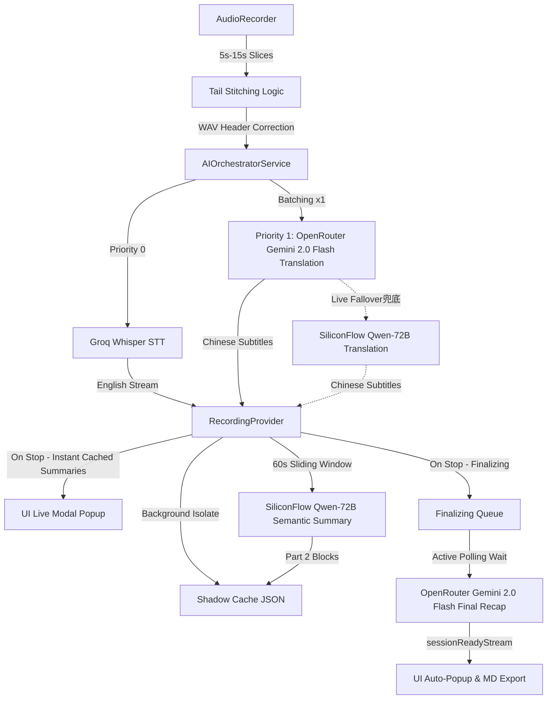

# Jeff Notes: Full Technical Specification & Architecture

## 1. System Overview
Jeff Notes is a production-grade academic assistant designed for high-concurrency audio transcription and professional academic translation. It operates on a **Session Isolation Architecture**, decoupling the active recording lifecycle from background AI finalization.

## 2. Core Data Flow (Zero-Latency Hybrid-Core Architecture)

## 3. Session Isolation & Concurrency
To allow users to start a new recording immediately after stopping the previous one, the system uses a **Finalizing Queue**:
- **LectureSession**: Every recording is encapsulated in a `LectureSession` object containing its own notes, orchestrator, and mode (Lecture/Discussion).
- **Decoupling**: When `stop()` is called, the `_activeSession` is moved to `_finalizingSessions`. The UI is immediately cleared for the next recording.
- **Background Finalization**: A non-blocking `_finalizeSession` task handles buffer flushing, STT/Translation settlement polling, final recap generation, and file exporting.

## 4. AI Orchestration & Mode Handling
### 4.1 Mode-Specific Pipelines & Zero-Latency
The system adapts its prompt strategies and UI rendering based on the `AppMode` to deliver a zero-latency simultaneous translation experience:
- **Academic Lecture**: Focuses on `Thesis Statement` and `Logic Maps`. Exports structured 60s Block Summaries and splits scripts into pure Chinese and English. UI uses **Blue** accents and `school` icons. **Latest Summary card is expanded by default.**
- **Group Discussion**: Focuses on strict `Concise Paraphrasing (Bilingual)` and `Discussion Starters`. UI uses **Purple** accents and `forum` icons. **Latest Summary card is collapsed by default (expandable on click) to save vertical screen space.**
- **FreeTalk**: Focuses on raw, lightning-fast bilingual transcription and translation. UI uses default styling and **Latest Summary card is collapsed by default.**
- **Instant Cached Summaries (Lecture Mode)**: To eliminate post-session waiting anxiety, clicking stop instantly aggregates all 60s semantic summaries cached in memory and pops them up in a beautiful Markdown modal, while the deep AI final recap executes in the background.

### 4.2 AIOrchestratorService
Acts as the central bus between raw text and intelligence.
- **Fast Track**: Sends every single text slice to the `fastEnglishStream` via Groq Whisper.
- **Zero-Latency Slow Track (Translation)**: By setting **`batchSize = 1`**, every 5-second slice is instantly translated.
- **Smart-Settling & Rolling Context**: The translation system prompt is optimized to detect unfinished sentences (input ending without punctuation) and translate them with a natural "hanging/unfinished" tone. This ensures translation continuity without awkward period insertions.
- **Active Live Failover**: In the event that the primary OpenRouter Gemini-2.0-Flash service fails due to rate limits or network issues, the orchestrator immediately fails over to the `translationFallbackService` (SiliconFlow Qwen-72B) to keep translation rolling without interruption.

### 4.3 ApiScheduler (The Traffic Cop)
- **4 Parallel Slots**: Manages 4 concurrent network requests across all sessions.
- **Prioritization**: `Priority 0` (STT) always preempts `Priority 1` (Summary/Translation).

## 5. Event-Driven UI & Auto-Popup
The UI does not poll for summary completion. Instead, it uses a **Reactive Notification Stream**:
- **sessionReadyStream**: A broadcast stream in `RecordingProvider`.
- **Trigger**: Emits the final recap content only when `_finalizeSession` is 100% complete.
- **Consumption**: `NotesScreen` listens to this stream and automatically triggers the `FinalReviewModal` regardless of the user's current interaction.

## 6. Audio Ingestion & Stitching Protocol
- **Overlap-Stitch Algorithm**: Captures a trailing 25,600 byte PCM segment (`kTailSize`) to prevent word-chopping at slice boundaries.
- **WAV Integrity**: Manually generates a 44-byte WAV header for each slice in a background Isolate.

## 7. Domain-Specific Translation (EAL Optimized)
- **Philosophy**: Uses a **Simultaneous Interpreter Prompt** with strict temperature (`0.1`) to ensure academic tone and technical term preservation.

## 8. Data Persistence Hierarchy
1. **Shadow Cache (Ephemeral)**: `shadow_draft.json` updated on every translation for crash recovery.
2. **MD Export (Permanent)**: Validated and exported upon session settlement. **Full Script (Part 3)** has been refined to split the transcripts completely (pure Chinese Transcript on top, followed by pure English Transcript) without timestamps or block counts for clean readability.

## 9. Development Environment (Hybrid Distributed Engine)
- **STT (Fast Track)**: Groq API (`whisper-large-v3`).
- **Translation (Real-Time)**: OpenRouter (`google/gemini-2.0-flash`) as primary, SiliconFlow (`Qwen/Qwen2.5-72B-Instruct`) as secondary fallback.
- **60s Sliding Summary (Background)**: SiliconFlow (`Qwen/Qwen2.5-72B-Instruct`) to preserve main-channel bandwidth and keep prompt execution highly accurate.
- **Final Summary (Intelligence)**: OpenRouter (`google/gemini-2.0-flash`) for rapid, high-context, cost-effective generation.
- **Framework**: Flutter 3.24.0+ (iOS 15.5+).
