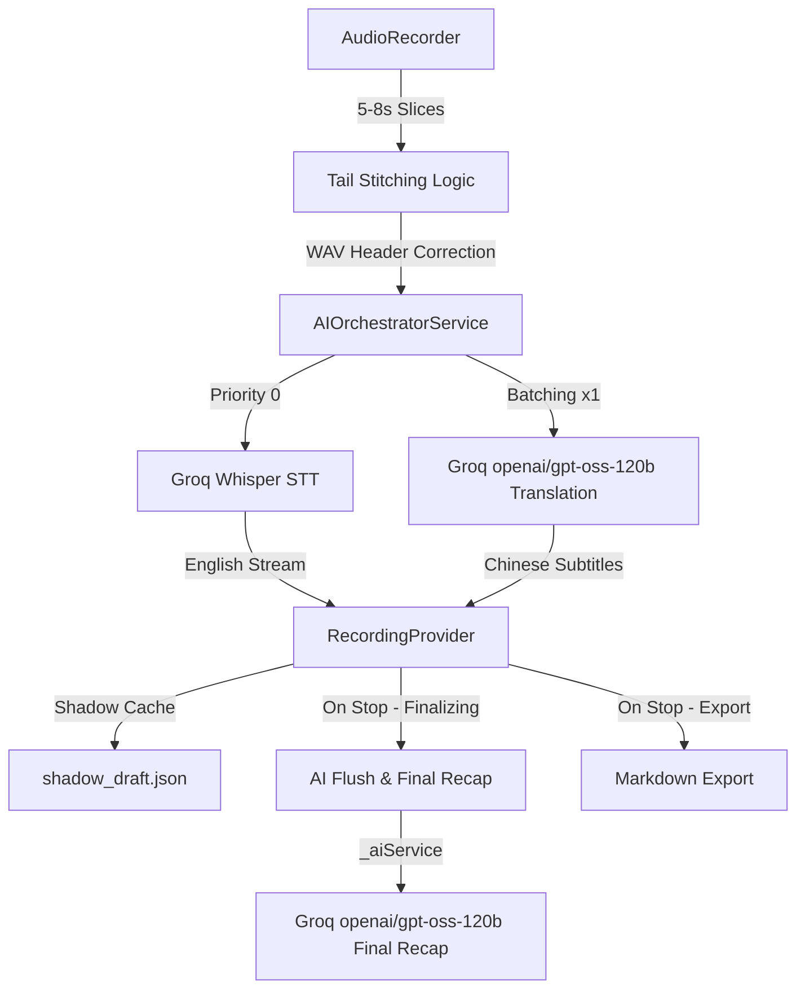

# Jeff Notes: Full Technical Specification & Architecture

## 1. System Overview
Jeff Notes is a production-grade academic assistant designed for high-concurrency audio transcription and professional academic translation. It operates on a **Session Isolation Architecture**, decoupling the active recording lifecycle from background AI finalization. The app is built with **Flutter 3.24.0+ (iOS 15.5+)**, using **Provider** for state management.

## 2. Core Data Flow (Zero-Latency Hybrid-Core Architecture)


## 3. Session Isolation & Concurrency
To allow users to start a new recording immediately after stopping the previous one, the system uses a non-blocking finalization pipeline:
- **RecordingProvider**: The central `ChangeNotifier` that manages the entire lifecycle — audio recording, AI orchestration, note storage, and export.
- **Decoupling**: When `stopRecording()` is called, the slice timer stops, the orchestrator flushes its buffer, and finalization begins asynchronously. The UI is immediately ready for the next recording.
- **Background Finalization**: `ApiScheduler.untilIdle()` waits for all pending AI tasks. The `generateFinalAcademicReview` flow handles: buffer flush, optional final recap, and Markdown export.
- **Shadow Cache Recovery**: On app start, `_checkRecoveryCache()` detects `shadow_draft.json`. Users can recover or dismiss pending notes.

## 3. AI Orchestration & Mode Handling
### 3.1 Mode-Specific Pipelines & Zero-Latency
The system adapts its prompt strategies and UI rendering based on the `AppMode` enum to deliver a zero-latency simultaneous translation experience:
- **Academic Lecture**: Focuses on `Thesis Statement` and `Logic Maps`. Exports structured 60s Block Summaries (`[P]` proposition, `[K]` key term, `[D]` data, `[L]` logic). UI uses **Blue** accents and `school` icons. **Latest Summary card is expanded by default.** On stop, instantly aggregates all cached summaries into a popup.
- **Group Discussion**: Focuses on strict `Concise Paraphrasing (Bilingual)` and `Discussion Starters`. Prompt extracts opinions (`[V]`), conflicts (`[C]`), consensus (`[A]`), and open questions (`[Q]`). UI uses **Purple** accents and `forum` icons. **Latest Summary card is collapsed by default (expandable on click).**
- **FreeTalk**: Focuses on raw, lightning-fast bilingual transcription and translation. No AI summary is generated. On stop, exports pure Chinese then pure English text without any headers or timestamps. UI uses default styling. **Latest Summary card is collapsed by default.**

### 3.2 AIOrchestratorService
Acts as the central bus between raw text and intelligence (`ai_orchestrator_service.dart`).
- **Fast Track (STT)**: Every audio slice is sent via `ApiScheduler` (priority 0) to Groq Whisper (`whisper-large-v3`). Raw text is sanitized by `TextSanitizer.clean()` (CJK removal, system marker stripping, word stutter dedup) and deduplicated via `mergeOverlappingText()`.
- **Zero-Latency Slow Track (Translation)**: By setting **`batchSize = 1`**, every 5-second slice is instantly translated via Groq `openai/gpt-oss-120b`. Results are split by sentence boundaries and distributed back to corresponding notes.
- **Smart-Settling & Rolling Context**: The translation system prompt is optimized to detect unfinished sentences (input ending without punctuation) and translate them with a natural "hanging/unfinished" tone. The last 2 translation pairs are injected as `[Previous Context]` to maintain coherence.
- **Active Live Failover**: When the primary translation service fails, the orchestrator falls back to `translationFallbackService`. In the current implementation, both primary and fallback are bound to the same Groq service instance.
- **Terminology Interceptor**: Currently in pass-through mode (`terminology_interceptor.dart`). LLMs proved unreliable at preserving placeholders, so raw English is translated directly.

### 2.1 Actual AI Service Binding (recording_provider.dart `_updateService()`)
All AI services are bound to **Groq** (`openai/gpt-oss-120b` for chat, `whisper-large-v3` for STT):

| Role | Service | Model |
|------|---------|-------|
| STT (Fast Track) | Groq | `whisper-large-v3` |
| Translation (Slow Track) | Groq | `openai/gpt-oss-120b` |
| Translation Fallback | Groq | `openai/gpt-oss-120b` (same instance) |
| Final Recap | Groq | `openai/gpt-oss-120b` |
| Essay Generation | Groq | `openai/gpt-oss-120b` |
| Reading AI (Quiz/Summary/Translation/Paraphrase/Vocab) | Groq | `openai/gpt-oss-120b` |
| Grammar AI (Exercise/Question/Correction) | Groq | `openai/gpt-oss-120b` |

**SiliconFlow (硅基流动) 实际使用情况**:
- **TTS 英文语音合成** (`tts_service.dart:943-978`): 使用 `FunAudioLLM/CosyVoice2-0.5B` Bella 女声做英文 AI 拟真音色合成。这是硅基流动在 App 中**唯一实际被使用**的功能。
- **STT 备选支持** (`openai_service.dart:63-70`): 代码层面支持硅基流动的 SenseVoiceSmall 模型做 STT（当 baseUrl 包含 siliconflow 时），但实际配置中 STT 走 Groq。
- **FreeTalk 翻译** (`recording_provider.dart:587-607`): 代码中有 `_translateViaSiliconFlow()` 方法，但实际调用的是 `_aiService!.translate()`，而 `_aiService` 被绑定为 Groq 服务，所以 FreeTalk 翻译实际走 Groq。

### 2.1 实际 AI 服务绑定一览

| 功能 | 实际服务 | 实际模型 |
|------|---------|---------|
| STT 语音转写 | Groq | `whisper-large-v3` |
| 实时翻译 | Groq | `openai/gpt-oss-120b` |
| 翻译兜底 | Groq | `openai/gpt-oss-120b` (同一实例) |
| 最终复盘 (Final Recap) | Groq | `openai/gpt-oss-120b` |
| 作文生成 | Groq | `openai/gpt-oss-120b` |
| 精读 AI (出题/摘要/翻译/转述/生词) | Groq | `openai/gpt-oss-120b` |
| 语法 AI (出题/问答/纠错) | Groq | `openai/gpt-oss-120b` |
| 英文 TTS 语音合成 | SiliconFlow (首选) | `FunAudioLLM/CosyVoice2-0.5B` Bella |
| 英文 TTS 降级方案 1 | Google Gemini | `Gemini 2.0 Flash` / `en-US-Studio-O` |
| 英文 TTS 降级方案 2 | Microsoft Edge | `en-US-JennyNeural` |
| 中文 TTS | iOS 原生 / 微软 Edge | `zh-CN-XiaoxiaoNeural` |

### 2.1 硅基流动 (SiliconFlow) 实际使用情况

硅基流动在 App 中**唯一实际被使用**的功能是 **TTS 英文语音合成** (`tts_service.dart:943-978`):
- 使用 `FunAudioLLM/CosyVoice2-0.5B` 模型，Bella 女声
- 作为英文 TTS 的首选方案，失败后降级到 Gemini → Edge Neural → iOS 原生

代码中存在的硅基流动备选支持（但实际未启用）：
- **STT 备选** (`openai_service.dart:63-70`): 当 baseUrl 包含 "siliconflow" 时，使用 SenseVoiceSmall 模型做 STT。但实际配置中 STT 走 Groq。
- **FreeTalk 翻译** (`recording_provider.dart:587-607`): `_translateViaSiliconFlow()` 方法存在，但实际调用的是 `_aiService!.translate()`，而 `_aiService` 被绑定为 Groq 服务。

## 3. Session Isolation & Concurrency
To allow users to start a new recording immediately after stopping the previous one, the system uses a non-blocking finalization pipeline:
- **RecordingProvider**: The central `ChangeNotifier` that manages the entire lifecycle — audio recording, AI orchestration, note storage, and export.
- **Decoupling**: When `stopRecording()` is called, the slice timer stops, the orchestrator flushes its buffer, and finalization begins asynchronously. The UI is immediately ready for the next recording.
- **Background Finalization**: `ApiScheduler.untilIdle()` waits for all pending AI tasks. The `generateFinalAcademicReview` flow handles: buffer flush, optional final recap, and Markdown export.
- **Shadow Cache Recovery**: On app start, `_checkRecoveryCache()` detects `shadow_draft.json`. Users can recover or dismiss pending notes.

## 4. AI Orchestration & Mode Handling
### 4.1 Mode-Specific Pipelines & Zero-Latency
The system adapts its prompt strategies and UI rendering based on the `AppMode` enum to deliver a zero-latency simultaneous translation experience:
- **Academic Lecture**: Focuses on `Thesis Statement` and `Logic Maps`. Exports structured Markdown with Full Script + AI Review + Block Summaries. UI uses **Blue** accents and `school` icons. **Latest Summary card is expanded by default.** On stop, triggers `FinalReviewModal` popup.
- **Group Discussion**: Focuses on strict `Concise Paraphrasing (Bilingual)` and `Discussion Starters`. Prompt extracts opinions (`[V]`), conflicts (`[C]`), consensus (`[A]`), and open questions (`[Q]`). UI uses **Purple** accents and `forum` icons. **Latest Summary card is collapsed by default (expandable on click).**
- **FreeTalk**: Focuses on raw, lightning-fast bilingual transcription and translation. No AI summary is generated. On stop, exports pure Chinese then pure English text without any headers or timestamps. UI uses default styling. **Latest Summary card is collapsed by default.**

### 4.2 AIOrchestratorService
Acts as the central bus between raw text and intelligence (`ai_orchestrator_service.dart`).
- **Fast Track (STT)**: Every audio slice is sent via `ApiScheduler` (priority 0) to Groq Whisper (`whisper-large-v3`). Raw text is sanitized by `TextSanitizer.clean()` (CJK removal, system marker stripping, word stutter dedup) and deduplicated via `mergeOverlappingText()`.
- **Zero-Latency Slow Track (Translation)**: By setting **`batchSize = 1`**, every 5-second slice is instantly translated via Groq `openai/gpt-oss-120b`. Results are split by sentence boundaries and distributed back to corresponding notes.
- **Smart-Settling & Rolling Context**: The translation system prompt is optimized to detect unfinished sentences (input ending without punctuation) and translate them with a natural "hanging/unfinished" tone. The last 2 translation pairs are injected as `[Previous Context]` to maintain coherence.
- **Active Live Failover**: When the primary translation service fails, the orchestrator falls back to `translationFallbackService`. In the current implementation, both primary and fallback are bound to the same Groq service instance.
- **Terminology Interceptor**: Currently in pass-through mode (`terminology_interceptor.dart`). LLMs proved unreliable at preserving placeholders, so raw English is translated directly.

### 4.3 ApiScheduler (The Traffic Cop)
- **4 Parallel Slots**: Manages 4 concurrent network requests across all sessions.
- **Prioritization**: `Priority 0` (STT) always preempts `Priority 1` (Translation).
- **Retry Policy**: 429 (rate limit) backs off `10s × attempt`; 500/503 backs off `2s × attempt`. Max 3 attempts per task.
- **Session-Aware Idle**: Supports `untilSessionIdle(sessionId)` and global `untilIdle()` for export safety.

### 4.3 Summary Engine
- **60s Sliding Window**: The `InsightNote` model has an `isSummary` field and the export code references "60s Block Summaries", but the actual `_performBatchSummary()` method that would generate these summaries **does not exist in the codebase**. No notes with `isSummary: true` are ever created during recording.
- **Final Recap (Optional)**: If `enableFinalRecap` is on, `generateFinalAcademicReview()` aggregates all transcript text and calls `_aiService.summarize(strategy: recap)`. Primary service failure triggers fallback. Markdown export is guaranteed via `try/finally`.

## 5. UI Structure

### 5.1 Screen Hierarchy
```
AcademicHubScreen (Home)
  ├── NotesScreen (Audio Transcription & Translation)
  ├── EssayConfigScreen (对比文章模板写作)
  ├── ReadingScreen (阅读精读列表)
  │     ├── ReadingSessionScreen (截图/PDF → OCR导入)
  │     └── ReadingDetailScreen (原文+摘要/翻译/转述/生词/AI出题)
  ├── GrammarScreen (语法精讲列表)
  │     └── GrammarDetailScreen (语法详情)
  └── HistoryScreen (Past Sessions)
        └── NoteDetailScreen (MD Viewer + PDF Export)
```

### 5.2 NotesScreen Layout (`notes_screen.dart`)
- **Summary Notification Banner**: Appears when `sessionReadyStream` emits new content. Auto-prompts modal in Lecture mode.
- **Cache Recovery Bar**: Detects unfinished sessions from `shadow_draft.json`.
- **Summary Panel**: Selector-bound to `notes.where(isSummary)`. Shows latest summary via `MarkdownBody`. Lecture mode expands by default; Discussion mode collapses.
- **Transcript List**: Each item shows English text + Chinese translation. `RepaintBoundary` + `ValueKey(note.id)` for efficient rendering. `ClampingScrollPhysics` prevents scroll bounce during async translation updates.
- **FAB (RecordingPulseFAB)**: Red pulse animation during recording, orange static glow when paused, mic icon when idle.

### 5.2 EssayConfigScreen (学术写作助手)
- **Dual-Input Topic Mechanism**: A custom `TextField` (hint: "例如: wearing masks") sits above a category-based topic grid. If the custom field is non-empty, it overrides the preset selection entirely.
- **46 Preset Topics in 11 Categories**: Transportation & Safety, Technology & Digital, Daily Life & Consumer, School & Study, Work & Career, Media & Entertainment, Health & Lifestyle, Environment & Sustainability, Society & Culture, Family & Relationships, Ethics & Technology Boundaries.
- **Topic Picker**: `ChoiceChip` grid (`Wrap` layout) displays chinese-only labels for one-glance scanning; category switch reloads the grid instantly.
- **Essay Type Toggle**: Comparison (Intro → Cost → Happiness → Time → Conclusion) or Argumentative (Intro → Cost → Happiness → Time-based Refutation → Conclusion).
- **Cost · Time · Happiness Framework**: Every essay is structured around these three concrete angles, replacing vague "advantages/disadvantages" with measurable dimensions.
- **AI Prompt** (in `RecordingProvider.generateEssayMatrix`): English 2-shot prompt with REGULATORY MATRIX (6 strict constraints) plus full Argumentative and Comparison essay examples. Models follow the shot examples to produce consistent structure, tone, and `==double equals==` transition marking.
- **Model**: Groq `openai/gpt-oss-120b` (not Qwen). Auto-retry once on failure (5s delay).
- **Export**: Auto-saves to Markdown (`Jeff_Essay_{topic}_{timestamp}.md`), clipboard copy, and PDF export via `PdfService`.

## 6. Event-Driven UI & Auto-Popup
The UI does not poll for summary completion. Instead, it uses a **Reactive Notification Stream**:
- **sessionReadyStream**: A broadcast stream in `RecordingProvider`.
- **Trigger**: Emits the final recap content when `generateFinalAcademicReview` is complete.
- **Consumption**: `NotesScreen` listens to this stream and automatically triggers the `FinalReviewModal` strictly during Lecture Mode. Real-time translation streams are completely separated from this stream to guarantee no premature, empty, or annoying banner popups during live recording sessions.

## 7. Audio Ingestion & Stitching Protocol
- **Smart Slice Timer**: A `Timer.periodic` fires every 5-8 seconds (user-configurable). Stops current recording and starts a new one (stop-start cycle).
- **Overlap-Stitch Algorithm**: Captures a trailing 25,600 byte PCM segment (`kTailSize`) to prevent word-chopping at slice boundaries. Stitching runs in a background Isolate via `compute()`.
- **WAV Integrity**: Manually generates a 44-byte WAV header for each slice (16kHz, 16-bit, Mono) in the background Isolate.
- **Pause/Resume**: Stops the slice timer and recorder without clearing notes. On resume, restarts recording and timer, seamlessly appending new slices.

## 8. Domain-Specific Translation (EAL Optimized)
- **Philosophy**: Uses a **Simultaneous Interpreter Prompt** with strict temperature (`0.1`) to ensure academic tone and technical term preservation.
- **Sanitization Pipeline (`text_sanitizer.dart`)**: CJK character removal, system marker stripping, invisible character removal, word stutter dedup (`_removeWordStutter`), and overlapping text merge for slice boundary dedup.

## 9. Data Persistence Hierarchy
1. **Shadow Cache (Ephemeral)**: `shadow_draft.json` written to temporary directory on every translation result, enabling crash recovery.
2. **MD Export (Permanent)**: Written to `getApplicationDocumentsDirectory()`. Filename format: `Jeff_Notes_yyyyMMdd_HHmm.md`. Structure: Part 1 (Full Script: Chinese + English), Part 2 (AI Academic Review), Part 3 (60s Block Summaries — currently unused as no summary notes are generated).
   - FreeTalk export: `Jeff_FreeTalk_yyyyMMdd_HHmmss.md` (pure Chinese then English, no headers).
   - Essay export: `Jeff_Essay_topicA_yyyyMMdd_HHmm.md`.
3. **PDF Export**: Via `PdfService` using `flutter_markdown` + `pdf`/`printing` packages.

## 8. Development Environment (Actual AI Service Binding)

| 功能 | 实际服务 | 实际模型 | 文件位置 |
|------|---------|---------|---------|
| STT 语音转写 | Groq | `whisper-large-v3` | `openai_service.dart:48` |
| 实时翻译 | Groq | `openai/gpt-oss-120b` | `recording_provider.dart:378-381` |
| 翻译兜底 | Groq | `openai/gpt-oss-120b` (同一实例) | `recording_provider.dart:381` |
| 最终复盘 (Final Recap) | Groq | `openai/gpt-oss-120b` | `recording_provider.dart:727` |
| 作文生成 | Groq | `openai/gpt-oss-120b` | `recording_provider.dart:1043` |
| 精读 AI (出题/摘要/翻译/转述/生词) | Groq | `openai/gpt-oss-120b` | `reading_quiz_service.dart:24` |
| 语法 AI (出题/问答/纠错) | Groq | `openai/gpt-oss-120b` | `grammar_service.dart:9` |
| 英文 TTS 语音合成 (首选) | **SiliconFlow** | `FunAudioLLM/CosyVoice2-0.5B` Bella | `tts_service.dart:943-978` |
| 英文 TTS 语音合成 (降级1) | Google Gemini | `Gemini 2.0 Flash` / `en-US-Studio-O` | `tts_service.dart:827-941` |
| 英文 TTS 语音合成 (降级2) | Microsoft Edge | `en-US-JennyNeural` | `tts_service.dart:781-824` |
| 英文 TTS 语音合成 (离线兜底) | iOS 原生 | Samantha/Ava/Karen | `tts_service.dart:640-674` |
| 中文 TTS (首选) | 微软 Edge | `zh-CN-XiaoxiaoNeural` | `tts_service.dart:510-555` |
| 中文 TTS (备选) | iOS 原生 | 系统中文语音 | `tts_service.dart:371-428` |

### 硅基流动 (SiliconFlow) 实际使用情况

硅基流动在 App 中**唯一实际被使用**的功能是 **TTS 英文语音合成** (`tts_service.dart:943-978`):
- 模型: `FunAudioLLM/CosyVoice2-0.5B`
- 音色: `bella` (高清流畅自然英文播音女声)
- 端点: `https://api.siliconflow.cn/v1/audio/speech`
- 作为英文 TTS 的首选方案，失败后降级到 Gemini → Edge Neural → iOS 原生

代码中存在的硅基流动备选支持（但实际未启用）:
- **STT 备选** (`openai_service.dart:63-70`): 当 baseUrl 包含 "siliconflow" 时，使用 SenseVoiceSmall 模型做 STT。但实际配置中 STT 走 Groq。
- **FreeTalk 翻译** (`recording_provider.dart:587-607`): `_translateViaSiliconFlow()` 方法存在，但实际调用的是 `_aiService!.translate()`，而 `_aiService` 被绑定为 Groq 服务。

## 9. Data Persistence Hierarchy
1. **Shadow Cache (Ephemeral)**: `shadow_draft.json` written to temporary directory on every translation result, enabling crash recovery.
2. **MD Export (Permanent)**: Written to `getApplicationDocumentsDirectory()`. Filename format: `Jeff_Notes_yyyyMMdd_HHmm.md`. Structure: Part 1 (Full Script: Chinese + English), Part 2 (AI Academic Review), Part 3 (60s Block Summaries — currently unused as no summary notes are generated during recording).
   - FreeTalk export: `Jeff_FreeTalk_yyyyMMdd_HHmmss.md` (pure Chinese then English, no headers).
   - Essay export: `Jeff_Essay_topicA_yyyyMMdd_HHmm.md`.
3. **PDF Export**: Via `PdfService` using `flutter_markdown` + `pdf`/`printing` packages.

## 9. Supabase Cloud Sync (FileSyncAgent)

### 9.1 Purpose
Automatic cloud backup of all `.md` export files. New recordings/writing exports are synchronised to Supabase `archives` table without modifying existing RecordingProvider or export logic.

### 9.2 supabase_config.dart
Encapsulates Supabase initialisation with a singleton pattern:
- `SupabaseConfig.url` – Supabase project URL (static const).
- `SupabaseConfig.anonKey` – Anon key for client-side access (static const).
- `SupabaseConfig.init()` – Calls `Supabase.initialize()` before `runApp()`.
- `SupabaseConfig.client` – Shortcut to `Supabase.instance.client`.

### 9.3 file_sync_agent.dart
- Launched in `main()` after Supabase initialisation.
- Recurring 30-second scan of `getApplicationDocumentsDirectory()` for `.md` files.
- Skips files already uploaded via `UploadCache` (SharedPreferences hash check).
- Uploads new files as `archives` rows with `module` inferred from filename: `essay`, `discussion`, `freetalk`, `reading`, or `listening`.
- Completely independent from RecordingProvider; no Provider dependency.

### 9.4 upload_cache.dart
- Thin wrapper over `SharedPreferences`.
- Stores MD5 hashes of uploaded file content to prevent duplicate sync.
- `isUploaded(hash)` / `markUploaded(hash)` / `clear()`.

### 9.5 Database Schema
```sql
CREATE TABLE archives (
  id        UUID DEFAULT gen_random_uuid() PRIMARY KEY,
  module    TEXT NOT NULL,
  file_hash TEXT NOT NULL UNIQUE,
  title     TEXT NOT NULL DEFAULT '',
  content_md TEXT NOT NULL DEFAULT '',
  metadata  JSONB DEFAULT '{}',
  file_size INTEGER DEFAULT 0,
  created_at TIMESTAMPTZ DEFAULT NOW()
);
```
Row-Level Security is **disabled** on `archives` for personal-project simplicity.

## 10. Reading Module (精读)

### 10.1 Architecture Overview
A completely independent module that reuses the `archives` table with `module='reading'` for storage. All code is isolated in `lib/screens/reading_*.dart` and `lib/services/reading_quiz_service.dart` – zero changes to recording/essay/history modules.

### 10.2 Screens

#### ReadingScreen (阅读列表)
- Loads entries from Supabase: `.from('archives').select().eq('module', 'reading').order('created_at', ascending: false)`.
- `RefreshIndicator` and AppBar refresh button for manual reload.
- `Dismissible` cards with swipe-to-delete.
- FAB navigates to `ReadingSessionScreen`.

#### ReadingSessionScreen (导入界面)
- **Screenshots**: Uses `ImagePicker.pickMultiImage()` for multi-select, `ReorderableListView` for drag-to-reorder, then OCR batch.
- **PDF Import**: Uses `FilePicker` + `pdf_render` to render each page to PNG → `OcrService.recognizeText()` (max 30 pages with progress).
- After OCR, joins page texts with `\n\n---\n\n`, saves to Supabase with `.insert({'module':'reading', ...})`.
- Success/failure feedback via SnackBar; pops back to list on completion.

#### ReadingDetailScreen (精读详情)
- Renders original text with toggle between Markdown-rendered and raw monospace view (AppBar toggle button `</>` ↔ `📄`).
- Title is tappable for inline rename (persisted to Supabase).
- Action buttons row 1: `[AI 出题] [📝 摘要] [📖 生词]`
- Action buttons row 2: `[🌐 翻译] [💬 转述] [导出]`
- Translation and paraphrasing open a bottom sheet with editable text (user can trim to specific passage before sending).
- Each AI result appears independently below the buttons, closable with ✕.

### 10.3 Services

#### ReadingQuizService (reading_quiz_service.dart)
Common Groq API caller with 5 static methods, all following the same pattern (read API key → call `openai/gpt-oss-120b` → return markdown string):
- `generateQuiz(text)` → 3 questions (main idea, detail, vocabulary)
- `getSummary(text)` → structured Chinese summary with key arguments and English terms
- `getTranslation(text)` → paragraph-by-paragraph bilingual translation
- `getParaphrase(text)` → simplified English + Chinese restatement
- `getVocabulary(text)` → ~20 academic words with definitions, examples, and Chinese glosses

Private helper `_callGroq(systemPrompt, text)` reduces duplication.

#### OcrService (ocr_service.dart)
- Wraps Google ML Kit `TextRecognizer` (Chinese + Latin scripts).
- `recognizeText(XFile)` → returns recognised plain text string.
- Runs 100% offline; no network dependency.

### 10.4 Prompt Additions (prompt_provider.dart)
5 new prompts added alongside existing lecture/discussion prompts:
- `getReadingQuizPrompt()` / `getReadingSummaryPrompt()` / `getReadingTranslationPrompt()` / `getReadingParaphrasePrompt()` / `getReadingVocabularyPrompt()`

### 10.5 AI Configuration
All reading AI features use:
- **Model**: Groq `openai/gpt-oss-120b`
- **API Key**: Read from `SharedPreferences` key `api_key_groq` (shared with existing STT service)
- **Temperature**: 0.5
- **Timeout**: 60 seconds

## 11. Dependencies Added (pubspec.yaml)

| Package | Version | Purpose |
|---|---|---|
| `supabase_flutter` | ^2.6.0 | Supabase client for cloud storage |
| `crypto` | ^3.0.6 | MD5/SHA256 hashing for upload cache and file_hash |
| `google_mlkit_text_recognition` | ^0.15.1 | Offline OCR (Chinese + Latin) |
| `image_picker` | ^1.1.0 | Multi-select photo import |
| `file_picker` | ^8.1.6 | PDF file selection |
| `pdf_render` | ^1.4.8 | PDF page-to-image rendering for OCR |
| `flutter_tts` | ^4.1.0 | Offline native text-to-speech for Chinese summary |
| `just_audio` | ^0.9.39 | Audio player for English realistic TTS and local recordings |
| `audio_service` | ^0.18.15 | System audio session and background playback integration |

## 12. Grammar Module (语法精讲)

### 12.1 Architecture Overview
A specialized grammar learning and correction system. It displays structural textbook data based on the Focus on Grammar 4 series, and integrates with LLM endpoints for practice and interactive questioning. All UI code is located in `grammar_screen.dart` and `grammar_detail_screen.dart`.

### 12.2 Repository Pattern (grammar_repository.dart)
Implements a **three-tier data source hierarchy** for retrieving academic grammar structures:
1. **Cloud (Supabase)**: Fetches curriculum details from the `grammar_units` table ordered by `sort_order` via HTTP GET.
2. **Local Cache File**: Serializes retrieved data to `grammar_units_cache.json` in the App Support Directory. Subsequent loads read from cache if offline.
3. **Hardcoded Backup**: Falls back to offline asset data defined in `grammar_content.dart` if both cloud and cache access fail.

### 12.3 Service & Prompts (grammar_service.dart)
Uses Groq API (`openai/gpt-oss-120b` model) with specialized prompts configured in `PromptProvider`:
- **generateExercise(unit)**: Generates 5 target grammar practice questions based on unit objectives.
- **askQuestion(unit, question)**: Provides contextual explanations for custom user queries about specific rules.
- **correctSentence(sentence)**: Performs sentence correction, highlighting structural improvements.

---

## 12. TTS Player & Service Module (语音朗读与播放安全)

### 12.1 Core Architecture
The system encapsulates audio playback through `TtsService` (a ChangeNotifier singleton) and provides an ultra-compact interactive playback UI via `TtsPlayerBar` (in `tts_player_bar.dart`).
To prevent cluttering the screen and blocking note text, `TtsPlayerBar` uses a single-row horizontal segmented tab bar (`[ 🇨🇳 中文大意 ] [ 🎙️ 课堂原音 ] [ 🇬🇧 英文 AI ]`) and renders ONLY ONE active player card at a time, reducing vertical height by >65%:
1. **Chinese Playback Pipeline (🇨🇳 中文朗读)**: Provides a 2-button engine selector inside `TtsPlayerBar`:
   - **Option 1 (`📱 iOS系统原生中文`)**: Synthesizes iOS system voice to `.caf` file and plays via `_audioPlayer` for accurate progress, seek, and play/pause toggle.
   - **Option 2 (`🌐 微软Edge晓晓女声`)**: Synthesizes 24kHz Studio Broadcasting Chinese Neural Female Voice (`zh-CN-XiaoxiaoNeural`) and plays via `_audioPlayer`. Fully distinct from Option 1!
2. **Real Classroom Audio Pipeline (🎙️ 真实课堂现场录音)**: Rendered when a merged recording (.wav) exists for the note. Plays the actual uncompressed classroom recording voice with dedicated progress control.
3. **English Speech Pipeline & Background Pre-Synthesis (🇬🇧 英文朗读 · 0秒秒开)**:
   - **Single High-Definition Voice**: Exclusive SiliconFlow CosyVoice2 Bella Female Voice (primary), with Gemini 2.0 Flash / Google Cloud TTS Studio-O as fallback, and Microsoft Edge JennyNeural as secondary fallback. iOS system robotic voice option removed completely.
   - **Background Pre-Synthesis (`prefetchEnglish`)**: As soon as a note is opened or Chinese summary playback starts, `prefetchEnglish()` silently triggers background neural TTS generation and local MP3 disk caching (`english_neural_$textHash.mp3`). When the user switches to English, playback starts **instantly in 0.000 seconds with zero wait time**!
   - **Full Stop & Pause Control**: `pauseEnglish()`, `stopEnglish()`, and `stopAll()` invoke `_flutterTts.stop()` and `_audioPlayer.stop()` synchronously, ensuring instant audio cancellation when tapping Stop or Pause.
4. **Karaoke Subtitle Synchronized Highlighting (🎤 卡拉OK 动态歌词字幕同步)**:
   - Synchronizes real-time audio playback position streams (`englishPositionStream` & `chinesePositionStream`) with note markdown content paragraphs.
   - Dynamically calculates progress ratios and highlights the active paragraph being spoken with a glowing gradient card container, bold typography, and a `🎤 卡拉OK 实时歌词字幕同步` badge.
   - Provides smooth 300ms animated transitions (`AnimatedContainer`) as speech moves line by line through the document.
5. **Tap-to-Seek-and-Play (👈 点击任意段落/句子秒定位跳转播放)**:
   - Each paragraph/sentence block is interactive (`GestureDetector`).
   - Tapping any sentence calculates the precise target duration offset and immediately seeks audio playback (`seekEnglish` / `seekChinese`) to that exact position in real-time.
   - If audio is idle when tapped, speech automatically starts and seeks to the selected sentence in one fluid interaction.

### 12.1 Headphone Safety & Automatic Interruption
To prevent accidental sound leakage in quiet environments (e.g., libraries, classrooms), the system enforces strict audio output safety rules:
- **AudioSession Playback Recovery (`ensurePlaybackSession`)**: Before every headphone check or TTS/recorded playback start, `TtsService` invokes `ensurePlaybackSession()` to switch `AudioSessionCategory` to `.playback` (clearing any residual `defaultToSpeaker` from recording) and calls `setActive(true)`.
- **Strict Route Output Check (`currentRoute.outputs`)**: On iOS/macOS, `_queryCurrentRoute()` inspects active physical output ports (`AVAudioSession.currentRoute.outputs`). If `builtInSpeaker` or `builtInReceiver` is present in active outputs, it is IMMEDIATELY blocked (`return false`). It never relies solely on paired device lists (`getDevices()`) because paired Bluetooth headphones remain in `getDevices()` even when taken out of ears or when iOS switches active output to the speaker.
- **Pre-Play Interruption & Retries**: `isHeadphonesConnected()` performs up to 3 retries (with 100ms intervals) to allow iOS hardware audio routing to settle after category activation. If no headphone output is active, playback is aborted with SnackBar notification (`⚠️ 未检测到耳机，请连接耳机后播放`).
- **Disconnection Listener & Periodic Monitor**: Subscribes to `AudioSession.devicesChangedEventStream` as well as running a 1.5s periodic background monitor (`_headphoneMonitor`). If headphones are unplugged or taken out of ears, `stopAll()` is called immediately to prevent any speaker leakage.
- **Microsoft Edge Neural TTS Protocol**: Uses `wss://speech.platform.bing.com` with `TrustedClientToken=6A5AA1D4EAFF4E9FB37E23D68491D6F4`, Chrome/Edge User-Agent, Origin `chrome-extension://jdiccldimpdaibmpdkjnbmckianbfold`, and dynamic 100-nanosecond Windows FileTime `Sec-MS-GEC` token calculation.

### 12.2 iOS Platform Configuration & Background Playback
To support background audio playback and system-level lock screen controls (lock screen control center) while maintaining strict safety, the audio session is configured as follows:
- **AVAudioSessionCategory.playback**: When playing TTS or recorded audio, the session is set to `.playback` mode. This ensures that the system allows playback to continue when the screen is locked or the app is sent to the background.
- **No Category Options (`AVAudioSessionCategoryOptions.none`)**: Since iOS automatically handles Bluetooth/AirPlay routing for playback-only categories, explicitly passing option flags like `.allowBluetoothA2DP` is invalid and will trigger an iOS parameter error (`OSStatus error -50`). Leaving options as `.none` (empty) allows the system to route audio to Bluetooth/AirPods correctly while ensuring successful initialization.

---

## 12. Note Deletion & Cloud Purge Synchronization (笔记彻底删除与云端同步)

### 12.1 Problem Solved
Previously, deleting a note from `HistoryScreen` only deleted the local `.md` file from `getApplicationDocumentsDirectory()`. Because the record remained in Supabase's `archives` cloud table, any pull-to-refresh or app restart re-downloaded the note from the cloud, causing "zombie notes" to reappear.

### 12.2 Atomicity & Synchronized Purge
The updated `_deleteEntry` logic in `HistoryScreen` and `NoteDetailScreen` executes a multi-tier purge:
1. **Local MD File**: Deletes the local `.md` file from device disk storage.
2. **Local Audio Recording File**: Deletes the corresponding `.wav` classroom recording file if present.
3. **Supabase Cloud Record**: Queries and deletes matching records from the `archives` table by both `id` and `title` via `SupabaseConfig.client.from('archives').delete()`.
4. **UI State & Swipe-to-Delete**: All entries in `HistoryScreen` support left-swipe dismissal (`Dismissible`) and an inline delete icon for instant, permanent removal.

## 13. Key Differences Between Documentation and Actual Code

| 文档描述 | 实际代码 | 差异说明 |
|---------|---------|---------|
| 硅基流动 Qwen-32B 做实时翻译 | Groq `openai/gpt-oss-120b` 做翻译 | `_updateService()` 将 `_aiService` 绑定为 Groq，非硅基流动 |
| 硅基流动 Qwen-72B 做翻译兜底 | Groq `openai/gpt-oss-120b` (同一实例) | 主服务和兜底服务是同一个 Groq 实例 |
| 硅基流动 Qwen-72B 做 60s 滑动窗口总结 | **未实现** | `_performBatchSummary()` 方法不存在，`isSummary` 字段从未被写入 |
| 硅基流动 Qwen-72B 做最终复盘 | Groq `openai/gpt-oss-120b` | `generateFinalAcademicReview()` 使用 `_aiService` (Groq) |
| 作文生成可选 Llama-3.3-70B / Qwen-32B / Qwen-72B | 仅 Groq `openai/gpt-oss-120b` | `generateEssayMatrix()` 只调用 `_groqService!.summarize()` |
| 硅基流动 SenseVoiceSmall 做 STT | 代码支持但实际未启用 | 实际 STT 走 Groq Whisper-v3 |
| FreeTalk 使用硅基流动 Qwen 翻译 | 实际走 Groq `openai/gpt-oss-120b` | `_translateViaSiliconFlow()` 调用的是 `_aiService!.translate()` |
| 英文 TTS 使用 SiliconFlow 高拟真 AI 音色 | ✅ **正确** | `CosyVoice2-0.5B` Bella 女声，失败后降级 |
| 60s 滑动窗口语义摘要 | **未实现** | `isSummary` 字段存在但从未被写入，`_performBatchSummary()` 不存在 |
