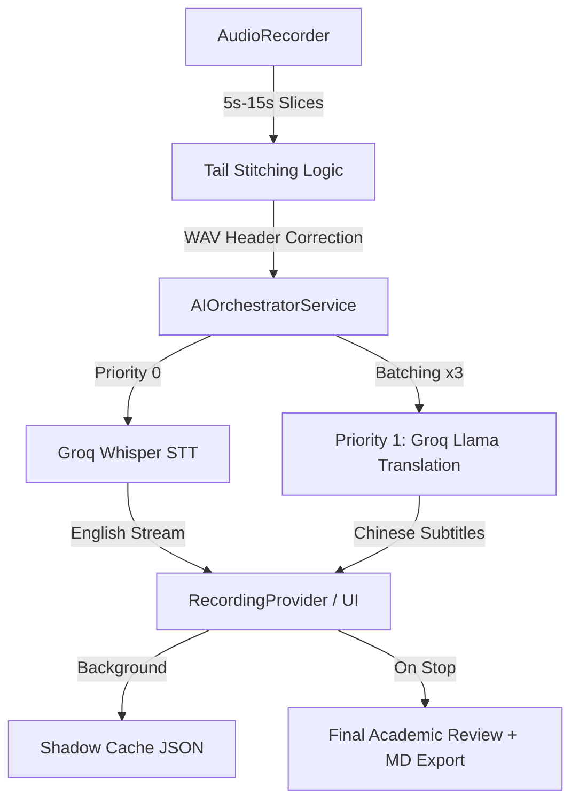

# Jeff Notes: Full Technical Specification & Architecture

## 1. System Overview
Jeff Notes is a production-grade academic assistant designed for high-concurrency audio transcription and professional academic translation. It operates on a **Reactive Pipeline Architecture**, decoupling low-latency audio capture from high-latency AI processing.

## 2. Core Data Flow (High-Level)

## 3. Audio Ingestion & Stitching Protocol
To prevent "word-chopping" at the boundary of audio slices, the system implements a **Overlap-Stitch Algorithm**:
- **Tail Buffer**: Every audio slice captures a trailing 25,600 byte PCM segment (`kTailSize`).
- **Stitching Task**: The next slice is prepended with this tail in a background Isolate (`_backgroundStitchTask`).
- **WAV Integrity**: Since slices are raw PCM, the system manually generates a valid 44-byte WAV header (`_generateWavHeaderStatic`) before sending to the API.

## 4. AI Orchestration & Parallelism
### 4.1 AIOrchestratorService
Acts as the central bus between raw text and intelligence.
- **Fast Track**: Sends every single text slice to the `fastEnglishStream`.
- **Slow Track**: Buffers 3 slices into a `_translationBuffer`. Once full (or on `flush`), it triggers the translation API.
- **Mutual Exclusion**: Uses `_isTranslating` flag to prevent race conditions during batch processing.

### 4.2 ApiScheduler (The Traffic Cop)
- **4 Parallel Slots**: Manages 4 concurrent network requests.
- **Prioritization**:
  - `Priority 0`: STT (Highest). If a summary is running, STT can still jump the queue.
  - `Priority 1`: Translation/Summary (Background).
- **untilIdle()**: A critical synchronization primitive that returns a `Future` only when all scheduled tasks are finished.

## 5. Domain-Specific Translation (EAL Optimized)
- **Philosophy**: Avoids tag-based masking (which confuses LLMs). Instead, it uses a **Simultaneous Interpreter Prompt**.
- **Constraint**: Strict temperature (`0.1`) and negative constraints ("DO NOT add explanations") suppress AI hallucinations.
- **Formatting**: Maintains academic tone and preserves proper nouns in original English.

## 6. Smart UI & Scroll Logic
- **State Source**: `RecordingProvider` (ChangeNotifier) is the single source of truth.
- **Auto-Scroll Engine**:
  - Monitors `UserScrollNotification`.
  - If the user interacts with the list, `_userIsScrolling` becomes `true` and a 3-second `Timer` starts.
  - While `_userIsScrolling` is `true`, `WidgetsBinding.instance.addPostFrameCallback` will NOT trigger `animateTo`.
  - This ensures the user can read a specific line without the list "jumping" under them.

## 7. Data Persistence Hierarchy
1. **Shadow Cache (Ephemeral)**: `shadow_draft.json` is updated on every successful translation. Prevents data loss on crash.
2. **MD Export (Permanent)**: Triggered on `stopRecording`.
   - **Sequence**: `stop()` -> `flush()` -> `untilIdle()` -> `generateReview()` -> `exportToMarkdown()`.
   - **Structure**: 
     - `# Part 1`: AI Deep Recap (Synthesized from block summaries).
     - `# Part 2`: 60s Block Summaries (High-level milestones).
     - `# Part 3`: Full Bilingual Script (Numbered source + translation).

## 8. Development Environment
- **Models**: Primary: `llama-3.3-70b-versatile` (Groq), Secondary: `SenseVoiceSmall` (SiliconFlow).
- **Native Dependencies**: 
  - `record`: Audio capture.
  - `path_provider`: File system access.
  - `audio_session`: iOS Audio Category management (PlayAndRecord).
